[原网页](<https://www.zhihu.com/question/24002080/answer/410983148>)

我们假设每个个体就是一台电脑，我们生活中的物品就是电脑中保存的文件。我们有一天想要与世界上其他地方的人交换货物，我们会用什么方法呢？

​        我们首先会看我们想要交换什么样的物品，如果是电子产品，可能会上苏宁易购，如果是书本，可能会上当当网，如果是服装裤子，可能会上淘宝或京东，如果是生活中的小玩意，可能会上咸鱼。**这些电商平台为我们交换货物提供了专用的通道和规则，我们称这些平台为应用层。**（应用层作用:为网络用户之间的通信提供专用的程序和协议）

提供不同服务的电商平台

​        假设我们最终选择在淘宝上卖给别人一个衣柜。而衣柜太大了不易邮递，我们要找木匠将衣柜拆分成一个个零部件，并封装、打包，附上组装说明书。对方在收到你的邮件后，也会找木匠按照说明书拆封、组装，让它重新成为一个完整的衣柜。**木匠的拆分/组装是为了衣柜更方便的传输，我们称木匠工作在表示层。**（表示层作用:提供数据压缩、解压、加密等服务，为应用层提供语法选择，语法转换）

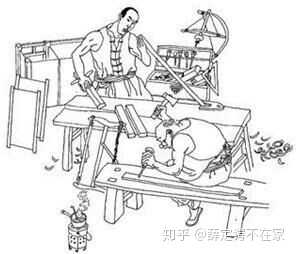拆分衣柜的木匠

​        木匠封装好了物品，会让客服在阿里旺旺中问一句:“您好，您确定够买了吗？如果您确定的话我就点确认下单，正式发货了。” 如果对面此时点了退款，那就不必发货了，如果对面回复“是”或没有回复，那么客服默认发货。发货的具体时间和数量是由客服决定的，客服可以选择当天全部发出去，也可以选择用两天时间分批次发出去。当然，对面也可以选择接收物品的时间（我们都有快递到了不能去取的经历）。而只有收件人在网上点击“确认接收”后，整个购买流程才会结束。**客服的工作是确认订单的开始/结束时间以及货物的发送/接收数量的，我们称客服工作在会话层。**（会话层作用:建立、管理和终止表示层实体之间的会话连接）

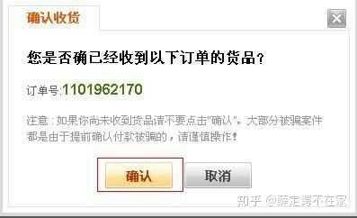认收货的页面

​        以上，用户购买流程结束了。剩下的是如何将货物发送过去的问题。同理，在电脑中，前三步之后用户的操作便结束了，剩下的是信息如何在网络中传递的问题。**因此，我们把前三层叫做OSI模型中的上层结构**。

​         那么货物要如何传递呢？那么远，客服肯定不能自己去送，客服会联系快递公司。如果是不能丢失的重要邮件，客服会选择EMS邮寄；如果是要求速度的隔日达，客服可能会选择顺丰快递。**快递公司的作用是保证你的货物能被对方顺利接收，快递公司就是我们常说的传输层，起到一个承上启下的作用。**（传输层作用:为会话层提供可靠的、无误的数据传输） **传输层是OSI模型中的中间层。**

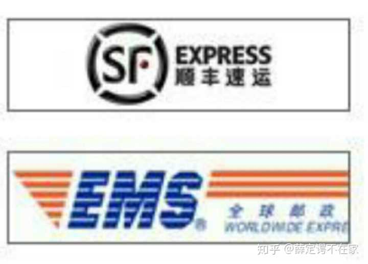提供不同服务的快递公司

​        快递公司收到了快件通知，会查看订单上的地址信息:“发件地址:北京市，收件地址:上海市”。此时，分拨中心会根据地址选择运输路径，计算途经哪几个分拨中心能最快/路径最短的将货物送达。**分拨中心根据地址信息提供路径选择，我们说分拨中心工作在网络层。**（网络层作用:基于IP地址为数据的传输进行网络间的路由选择）

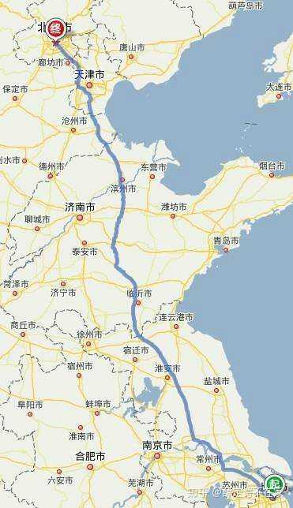北京到上海的路径选择

​        快递公司收到快递订单后，会派快递小哥到发件人所在地址，根据发件人的姓名和电话联系到发件人，取走货物，**送往当地分拨中心。**同理，**当货物到达收件地的分拨中心后**，当地的快递小哥会根据收件人的姓名和电话联系到收件人，将货物安全送达。**快递小哥是通过姓名和电话（相当于Mac地址）联系到个人的，我们说快递小哥工作在数据链路层。**（数据链路层作用:物理地址寻址，为网络层提供数据传送服务）

​         货物运输途中，都由司机大哥开不同的卡车、汽车、三轮车运送。**我们说司机大哥和交通工具们工作在物理层。**（物理层作用:为数据传输提供物理媒体，进行数据的实际传输）

​        从快递公司接收货物开始，后面的所有流程都是货物在城市内/城市间的运输过程。在网络内也一样，从传输层建立连接开始，后面的所有流程都是数据包在网络内/网间的传递，与操作用户本身再无关系。**因此，我们把后三层叫做OSI模型中的下层结构。**

​        然而实际生活中，我们往往不会分那么细，老板，木匠，客服的活往往一个人就做了。运输过程也是一样，快递小哥经常客串司机的角色。

​        其实网络中也是一样。从电脑的角度来看，如果一台电脑要给另一台电脑发送文件，它首先会查看发送内容，通过发送内容选择发送平台。比如发送邮件用Email，发送图片用QQ。不同的应用程序有着不同的通信协议（Email——SMTP，Web——Http，文件传输——Ftp等），这些通信协议都工作在应用层。

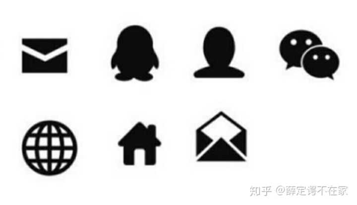使用不同应用层协议的APP

​        假设我们决定用QQ发送一张图片，我们电脑会在传送前先在后台对这张图片进行编码、加密和压缩，这一过程工作在表示层。

​        用QQ传送文件时，我们会被问到“是否发送”，对面也会看到“是否接收”。如果接收失败，会告诉你发送失败，问你是否重传；接收成功后，也会有对话框告诉你发送成功。这些，都工作在会话层。  

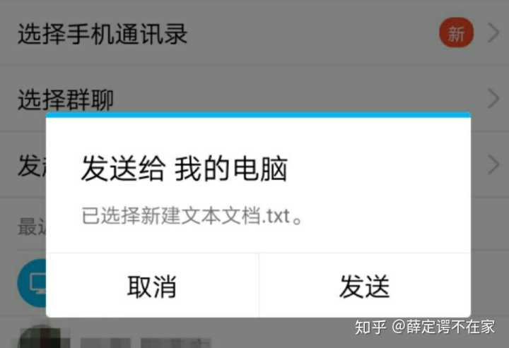确认发送对话框

​        这边确定发送，那边也确定接收后，会通过TCP/UDP协议建立通道，保证传输的可靠性。TCP/UDP协议工作在传输层。

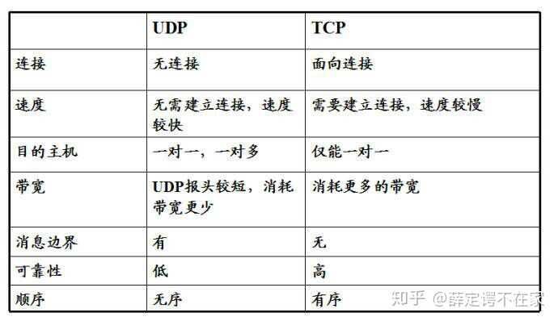

​        文件在网络传输过程中，通过IP地址，由路由器选择传输路径，路由器工作在网络层。

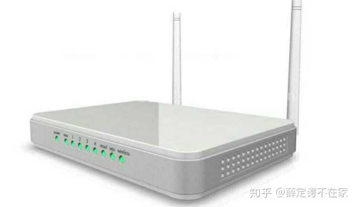路由器

​        文件在网络传输过程中，在网内通过物理地址（Mac地址）由交换机进行数据的传送。交换机工作在数据链路层。

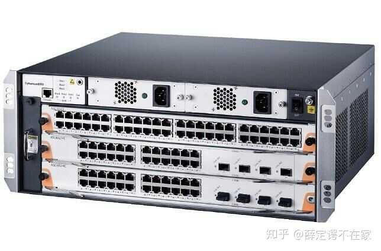交换机

​        网线/光纤负责发送比特流，提供信息传送的物理介质。

​        同样，网络中，我们也可以把前三层总结到一起，称为应用层。把后两层总结到一起，称为数据链路接口层或网络接口层。这样，就把繁琐的OSI七层结构转化为了精简的TCP/IP四层结构。

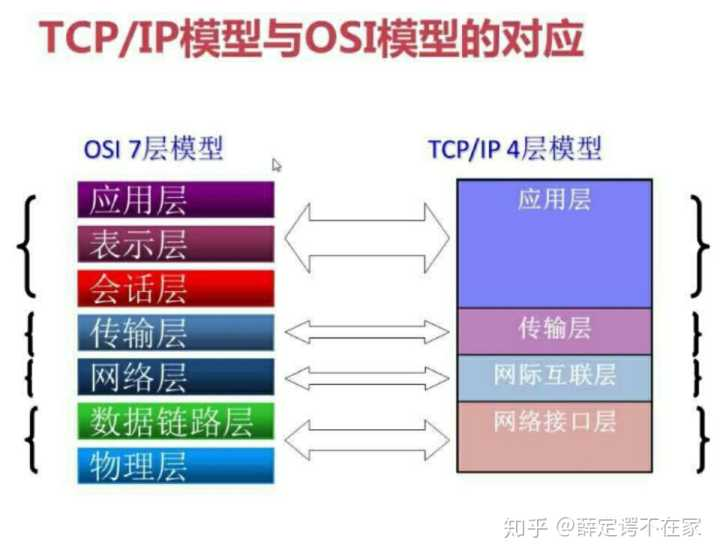

**总结:应用层——电商平台（应用软件中对应的SMTP，Http，Ftp等应用层协议）**

​         **表示层——木匠（负责数据压缩、编码）**

​         **会话层——秘书（负责文件发送/接收）**

​         **传输层——快递公司（EMS——TCP；顺丰——UDP）**

​         **网络层——分拨中心（路由器）**

​         **数据链路层——快递小哥（交换机）**

​         **物理层——司机大哥和交通工具（网线/光纤）**

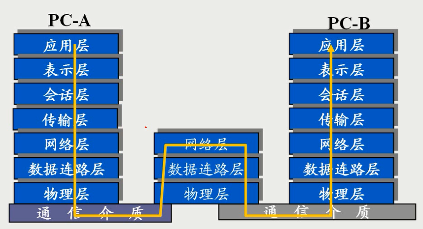