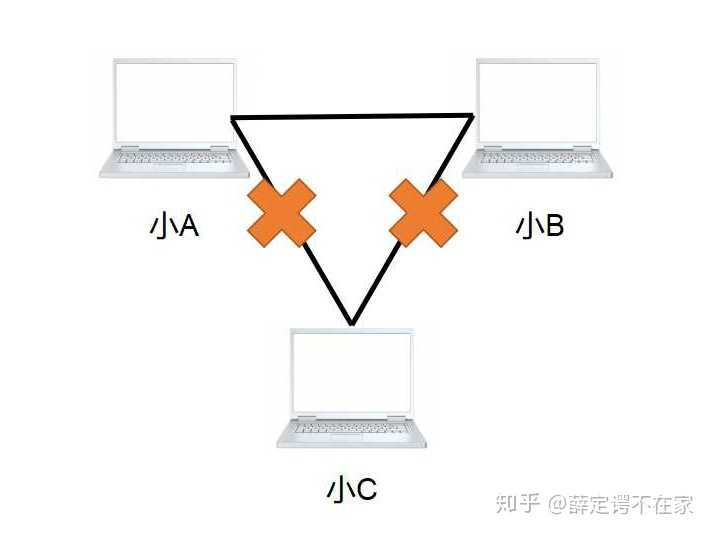

[原网页](https://www.zhihu.com/question/22007235/answer/402261894)

我相信我们都玩过一款特别火的游戏：帝国时代。小时候想要玩帝国时代，需要到软件城购买盗版光盘安装（大概3块钱一张左右的样子，当时已经觉得很便宜了，谁想到现在有了网络之后是免费）。下载完成后只能进行单机模式。

​        小A是一个帝国时代大神，他打通了游戏的所有关卡，可以一个人单挑8个疯狂的电脑。渐渐他觉得无聊了，想要找小伙伴一起PK。

​        但是如何实现两台设备的互联呢？小A很聪明，他发明了一个类似于USB口一样的可以传输数据的端口，他将其命名为网口。小A通过一根网线将自己的电脑与小B的网口相连，实现了两台电脑间的互连。

​        两个小伙伴很开心，联机玩了起来，这时被路过的小C看见了，小C也要加入进来。但是我们知道，每台电脑只有一个网口，无法实现三台电脑的相互连接，那要要怎么办呢？

​        这时候小B出了一个主意：咱们再找一台计算机，给他多设计几个网口，我们每个人都连到这台计算机的网口上，不也实现咱们哥几个之间的互连了吗。

​        说干就干，于是他们设计出了一款微型计算机，他本身具备多个网口，专门实现多台计算机的互联作用，这个微型计算机就是集线器（HUB）。顾名思义，集线器起到了一个将网线集结起来的作用，实现最初级的网络互通。集线器是通过网线直接传送数据的，我们说他工作在物理层。

​        有了集线器后，越来越多的小伙伴加入到游戏中，小D、小E等人都慕名而来。然而集线器有一个问题，由于和每台设备相连，他不能分辨出具体信息是发送给谁的，只能广泛的广播出去。例如小A本来想问小C：你吃了吗？结果小B，小D和小E等所有连接在集线器上的用户都收到了这一信息，且由于处于同一网络，小A说话时其他人不能发言，否则信息间会产生碰撞，引发错误，我们叫做各设备处于同一冲突域内。

​        这样的设备用户体验极差，于是小伙伴们一起讨论改进措施。这时聪明的小D发话了：我们给这台设备加入一个指令，让他可以根据网口名称自动寻址传输数据。比如我把小A的网口命名为macA，将小C的命名为macC，这时如果小A想要将数据传给小C，则设备会根据网口名称macA和macC自动将资料从A的电脑传送到C的电脑中，而不让小B、小D和小E收到。也就是说，这台设备解决了冲突的问题，实现了任意两台电脑间的互联，大大地提升了网络间的传输速度，我们把它叫做交换机。由于交换机是根据网口地址传送信息，比网线直接传送多了一个步骤，我们也说交换机工作在数据链路层。

​        这回小伙伴们高兴了，他们愉快地玩耍起来。渐渐地，他们在当地有了名气，吸引了越来越多的小伙伴加入到他们的队伍中。直到有一天，一个外村的小伙突然找上门来，希望能和他们一起互联，实现跨村间的网络对战。

​        小A说可以呀，于是他们找了一根超长的网线将两个村落的交换机连在了一起。结果发现一件奇怪的事：两个村落间竟然不能相互通信。怎么着，原来那边的电脑和他们用的不是一套操作系统，这导致信息间的传送形式的不匹配。在这期间，还有其他村落的人也来找过小A，可是小A发现，每个村子之间用的操作系统都不一样。

​        这可咋办呐？难道以后只能各自村子玩各自的了吗？为了解决这一问题，各村的小伙伴们坐在一起组织了一场会议，最终得出了一套解决方案：采用同样的信息传送形式（像不像秦始皇统一度量衡）。那如何实现呢？小伙伴们规定，不同的村子间先在各自的操作系统上加上一套相同的协议。不同村落通信时，信息经协议加工成统一形式，再经由一个特殊的设备传送出去。这个设备就叫做路由器。路由器通过IP地址寻址，我们说它工作在计算机的网络层。

​        这样，经由如此的一系列改装，小A终于带领村民们实现了整个乡镇的通信。随着越来越多的城里人也加入小A的协议，小A带领村民逐步实现了全市、全国乃至全世界的通信。这一套协议便是TCP/IP协议簇，互联网也便这样形成了。

​        然而，即便如今全网络已遍布了全世界，在小A和村里的小伙伴对战帝国时代的时候，也仍然用着交换机。只有和外面更大的世界交流的时候才用到路由器。 

总结：交换机适合局域网内互联，路由器实现全网段互联。

​        这里再单独解释一下猫：猫的学名叫调制解调器，它的作用是将数字信号（电脑想要发送的信息）转换成模拟信号（网线中的电流脉冲）从而使信息在网线中传输。

​       由于计算机的一切信号都要由电流脉冲传送出去，因而猫是必须的。目前的家用路由器一般都是路由猫，即路由器兼顾了猫和简单交换机的功能，因而在选购时，选一款性价比超高的路由猫就可以了。