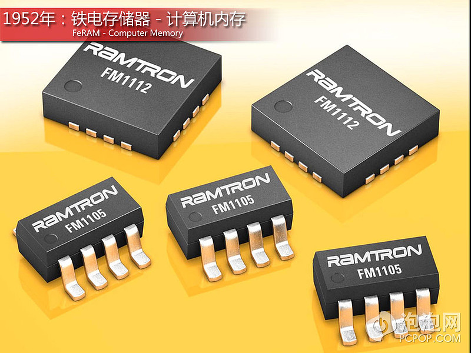
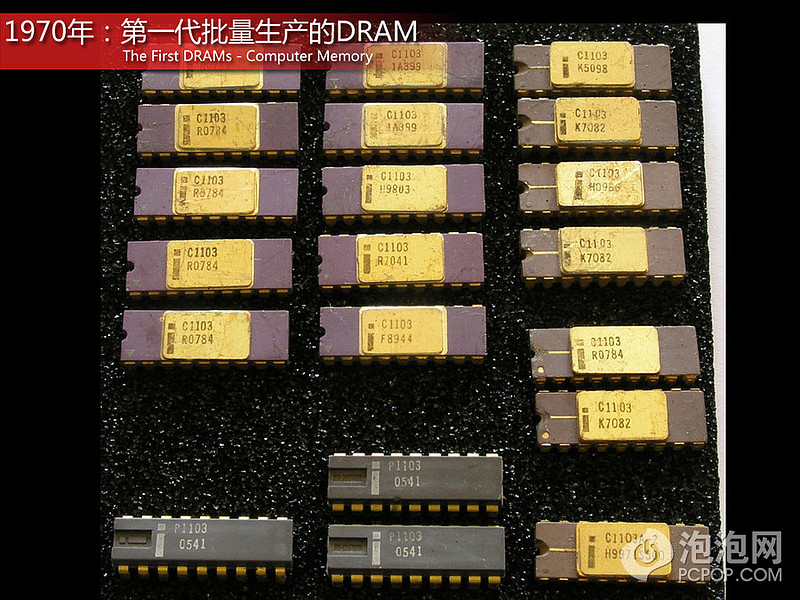

[原网页](https://xueqiu.com/3993902801/88454857)

计算机内存，通常都是些DRAM和Flash闪存之类的东西，而实际上，无所不在的内存储技术能发展到今天的成就，确实走了一段非常长久的路程。那么今天我们就带着大家回到160年前，讨论一下这个里程碑式科技产品，以及内存技术，而且很可能有些产品或者技术，你都从未听说过。

打孔卡或穿孔卡(或霍列瑞斯式卡或IBM 卡)，是一块纸板，在预先知道的位置利用打洞与不打洞来表示数位讯息 (digital information)。在上世纪80年代，还有很多大学里都在使用这种传统的信息媒介，作为图书馆中图书检索的工具。实际上，打孔卡出现的时间要远得多。在19世纪的英国，有位著名的数学家查尔斯·巴贝奇，在1812年初次想到可以利用机械来计算数学表，也就是“可编程计算器”，于是在1834年到他去世的1871年期间，一直在试图建立一个叫“分析机（Analytical Engine）”的东西，而分析机实际上就是现代计算机的前身。就是利用打孔卡，作为分析机的只读存储器，相当于675个字节。

奥地利IT工程师Gustav Tauschek发明了第一个被广泛使用的计算机存储器，被称之为“磁鼓存储器”。“磁鼓存储器”被发明与1932年，但是经过20多年的时间，这项技术才被广泛应用。在“磁鼓存储器”被发明的后10年中，还有一些其他类型的存储器。比如德国工程师康拉德·楚泽Konrad Zuse发明的Z3计算机，就使用了机械滑动金属存储器，而Z3则被称之为世界第一台“图灵完全”的计算机（一种可不受储存容量限制的假想计算机）。阿塔纳索夫-贝瑞计算机，使用电容器列阵配合两个旋转鼓，进行打孔计算，与打孔板相同存储解决方案。而最著名的ENIAC计算机利用汞和镍构成水银延迟线存储器。到了20世纪50年代，由水银延迟线、阴极射线示波管静电存储器、磁鼓、磁芯等设备，构成了最早期电子计算机的主存储器。

磁芯存储器是另外一个被广泛采用的存储技术，也是现代计算机主存储器发展的第二个重要的里程碑式的技术。尽管大多数人都认为，这项技术的所有关键部件直到1951年才被开发出来，但是实际上，这所有的想法都要追溯1949年，麻省理工学院的Jay Forrester首先提出了这项技术的构想。与此同时，美籍华裔科学家王安博士，对磁芯存储器的研究有着稍微不同的看法。磁芯存储器对核心的最基本的原理，就是使用了一个“磁芯”，磁芯在导线上流过一定电流下会被磁化或者改变磁化方向，有了两个不同的结果，这就可以作为0和1的状态来记录数据，并且获得了专利保护。在20世纪60年代到20世纪70年代初，全球90%以上的电脑都开始使用非易失性磁芯存储器技术。

超声波存储器在主存储器发展中重要的一环，被使用在EDVAC离散变量自动电子计算机上，这套系统超声波存储器拥有1024个44位，相当5.5KB的存储容量。

FeRAM铁电存储器，在1952年，麻省理工学院研究生Dudley Allen Buck，在他的硕士论文中就有了对“FeRAM铁电存储器”的讨论，而他论文的题目就是“铁电体的数字信息存储与数据交换”。这项技术在花了30年的时间之后，在1991年，由美国国家航空航天局的喷气推进实验室，最终将这套概念付之于现实。Ramtron公司是最早成功制造出FeRAM的厂商，同一时期，富士通、IBM和德州仪器也是FeRAM产品的重要制造厂。不过对于新型FeRAM芯片的研发，依旧是目前各大研究中心的研发课题。

选数管是数字计算机存储设备的一种早期形式。在1964至1953年之间，是在弗拉基米尔·佐利金（以发明电视机知名）的指导下，由Jan A. Rajchman和他的团队在RCA公司研发的。这种存储器的容量为32到512字节，512字节的那种有10英寸长，3英寸宽。在磁芯存储器开始广泛流行之前，选数管的开发团队并未能够生产出可用于商业的选数管，因此，直到今天，选数管在应用上仍然不为大多数人了解。

一个SRAM存储器要追溯到1964年，是由仙童半导体公司研发的，64位金属氧化半导体（MOS）静态随机存储器（SRAM）。然而在1969年，Intel成功研发出256位SRAM存储器，被命名为1101芯片，并且在1971年正式推出。而1101芯片是全世界第一个大规模生产并利用的，利用硅半导体技术的MOS内存储器。不同于DRAM，SRAM不需要周期性更新，只要保持通电，里面储存的数据就可以恒常保持。而当电力供应停止时，SRAM储存的数据还是会消失。包括在如今不少CMOS中的MOSFET仍在应用这样存储技术。而SRAM也被视为现代内存储技术发展的奠基石。

DRAM是我们如今正在使用的计算机内存的基础，在1966至1967年，由IBM公司Thomas J. Watson研究中心的Robert Dennard发明，并且早在1968年申请了专利保护。

Phase-change memory（PCM或PRAM）相变化存储器，即便是在它被发明50年后的今天，仍然处于研发的萌芽阶段。在1969年，爱荷华州立大学的Charles Sie在其博士论文中就提到了这项存储器技术，并且介绍说，相变化存储器PCM使用含一种或多种硫族化物的玻璃（Chalcogenide glass）制成。硫族化物玻璃的特性是，经加热可以改变它的状态，成为晶体或非晶体。这些不同状态具有相应的电阻值，因此 PRAM 可以用来存储不同的数值。而斯坦福大学的Stanford Ovshinsky，认为硫族化物玻璃则会让PCM成为一种非常具有发展潜力的内存储器技术。Intel的联合创始人戈登·摩尔也曾在1970年发表文章，表示过同样的看法。不过这项技术由于复杂的技术限制，直至今天还处于研究状态，而有消息说，三星公司则有希望第一个成为开发出PRAM的公司。

第一个已知的DRAM芯片（256位）是由仙童半导体公司的工程师Lee Boysel，与1968年研发成功。后来1969年，Lee Boysel建立了自己四象限（Four Phase Systems）公司，成功的开发出1024位和2048位DRAM内存储器芯片。然而在1970年，Intel推出1103芯片却成了首个大批量生产并且被广泛应用的内存储器芯片产品。此后，1024位芯片在1972年成为全球最畅销的半导体芯片。而在这一年，已经拥有超过1000名的雇员，以及超过2300万美元的巨额营收。“1103芯片”被业界认为是“磁芯存储器杀手”,，并且也为后来计算机大容量存储芯片发展奠定了坚实的基础。

第一个可擦除可编程式只读存储器EPROM（有时候也被成为EROM），在1971年由Intel的以色列工程师Dov Frohman发明。第一个正式投产的EPROM型号为i1701，采用8个容量为256比特的模块组成，使得总容量为2048比特。EPROM是一种断电后仍能保留数据的计算机存储芯片——即非易失性的（非易失性）。它是一组浮栅晶体管，被一个提供比电子电路中常用电压更高电压的电子器件分别编程。一旦编程完成后，EPROM只能用强紫外线照射来擦除。通过封装顶部能看见硅片的透明窗口，很容易识别EPROM，这个窗口同时用来进行紫外线擦除。在1978年，Intel工程师George Perlegos在开发Intel 2816时，在EPROM技术的基础上，改用薄的闸极氧化层，以便无需紫外光，芯片就可以用电气方式抹除自身的比特，因而开发出型号为2816的16kbit EEPROM。

Flash闪存(无论是NOR型或NAND型)是舛冈富士雄博士在1984年于东芝公司工作时发明。据东芝表示闪存之所以命名为 “Flash” 是由舛冈博士的同事所持有泉建议，因为这种存储器的抹除流程让他想起了相机的闪光灯。舛冈博士在1984年的加州旧金山IEEE国际电子组件大会(International Electron Devices Meeting, IEDM)上发表了这项发明。Intel看到了这项发明的巨大潜力，并于1988年推出第一款商业性的NOR Flash芯片。这款Flash存储芯片的容量仅为256KB，外形大小相当于一个鞋盒。当然如今的Flash芯片已经运用的相当广泛，并且已经拥有了海量的存储能力，包括手机芯、U盘、SSD等等。即便在21世纪初，有专家认为Flash存储技术将会被 Ovonics Unified memory (OUM)、纳米晶体、MRAM、FeRAM、PFRAM、PCRAM或者Nanotube RAM (NRAM)等技术应用所取代，目前替代闪存的产品有许多，但是哪条路能够成功，以及何时成功仍然值得怀疑，Flash芯片依旧是市场上的中流砥柱。

磁阻式随机存取内存（Magnetoresistive Random Access Memory，缩写为MRAM），是一种非挥发性内存技术，从1990年代开始发展。这个技术的拥护者认为，这个技术可望取代快闪存储器与DRAM，成为真正的通用型内存（Universal memory）。在1989年至20世纪90年代，在MRAM技术的研发中，IBM的研究中心发现可以利用巨磁电阻效应，在不同的磁化状态具有不同电阻值的特点，可以制成随机存储器（MRAM）。于是在2000年IBM公司与英飞凌公司建立合资公司，计划将MRAM内存技术商业化，但是最终仅生产出工艺180纳米、容量为128K比特的MRAM存储芯片。并且至今，对于MRAM的研发仍然需要进一步的技术突破，MRAM的也仍处于研发阶段。不过目前，MRAM已经在通信、军事、数码产品上有了一定的应用。

尽管SDRAM的概念至少从20世纪70年代就已经被人们所熟悉，在早期的Intel处理器上也已被采用，但要说到它在电子工业被广泛接受，那是从1993年才开始的。1993年，三星开始展示其新出品的KM48SL2000 SDRAM，到2000年，SDRAM因为其卓越的性能，实际上取代了其它类型的DRAM在现代计算机中的位置。SDRAM内存在JEDEC的PC100规范下，可以达到100MHz的速度，而SDRAM内存还拥有其他版本号的一些产品，包括低端的PC66和高端的PC133。如今世界最大的SDRAM制造商包括：三星电子（Samsung Electronics）、美光科技（Micron Technology）和HY(Hynix)。

在1996年至2000年期间，JEDEC在制定DDR SDRAM规范时，定义DDR为SDRAM的延续产品。而首次登场亮相DDR（一代）内存，包括了133、166和200MHz速度频率的三款产品，对应的版本号为DDR-266、DDR-333以及DDR-400。而在2000年6月，JEDEC则推出了第一个DDR SDRAM规范。随后在2003年第二代DDR芯片——DDR2推出，包括200、266、333、400以及533MHz度频率的五款产品，对应的版本号为DDR2-400、DDR2-533、DDR2-667、DDR2-800以及DDR2-1066。到了2006年第三代内存DDR3推出，包括了400、533、667以及800MHz四个版本（DDR3-800、DDR3-1066、DDR3-1333以及DDR3-1600）。而第四代DDR4内存，根据计划将于2014年推出。

RDRAM或者DRDRAM (Direct Rambus DRAM) 是由美国的RAMBUS公司于20世纪90年代末，开发的一种SDRAM内存，也是尝试取代SDRAM内存而不太成功的案例之一。当时，Intel正要推出他们的重磅产品——奔腾4处理器，而RAMBUS公司也打算借此良机为自己亲历打造的RDRAM内存打造声势，而这个新型内存的最大的优点就是，要比SDRAM内存拥有更高的带宽和时钟频率。尽管RDRAM在奔腾4处理器上市前，得到英特尔公司3亿美元投资的大力支持，并促使三星为其代工生产。但是RDRAM在推出时，因为其彻底改变了内存的传输模式，无法保证与原有的制造工艺相兼容，而且内存厂商要生产RDRAM还必须要加纳一定专利费用，再加上其本身制造成本，导致了RDRAM从一问世就高昂的价格让普通用户无法接受。但始终没有成为主流。而目前仅有一些电视游戏主机、服务器和网络设备中，还在少量使用RDRAM内存，比如索尼的PS3游戏主机。
