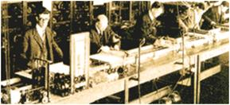
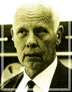
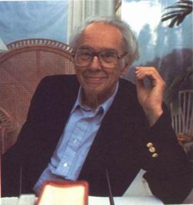
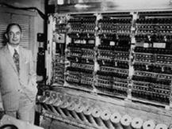
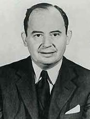
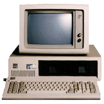
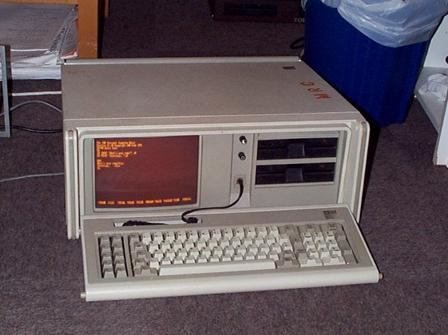
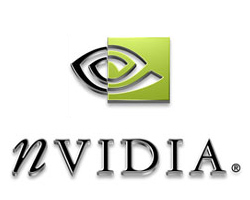
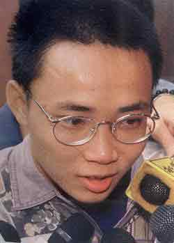

[原网页](https://news.mydrivers.com/1/29/29654.htm)

##  **[史前时代：1623——1903]**

1623年：德国科学家契克卡德（W. Schickard）制造了人类有史以来第一台机械计算机，这台机器能够进行六位数的加减乘除运算。

1642年：法国科学家帕斯卡（B.Pascal）发明了著名的帕斯卡机械计算机，首次确立了计算机器的概念。1971年发明的一种程序设计语言——PASCAL语言，就是为了纪念这位先驱，使帕斯卡的英名长留在电脑时代里。

1674年：莱布尼茨改进了帕斯卡的计算机，使之成为一种能够进行连续运算的机器，并且提出了“二进制”数的概念。（据说这个概念来源于中国的八卦）

1725年，法国纺织机械师布乔（B.Bouchon）突发奇想，想出了一个“穿孔纸带”的绝妙主意。布乔首先设法用一排编织针控制所有的经线运动，然后取来一卷纸带，根据图案打出一排排小孔，并把它压在编织针上。启动机器后，正对着小孔的编织针能穿过去钩起经线，其他的针则被纸带挡住不动。这样一来，编织针就自动按照预先设计的图案去挑选经线，布乔的“思想”于是“传递”给了编织机，而编织图案的“程序”也就“储存”在穿孔纸带的小孔之中。

1805年，法国机械师杰卡德（J.Jacquard）根据布乔“穿孔纸带”的构想完成了“自动提花编织机”的设计制作，杰卡德为他的提花机增加了一种装置，能够同时操纵1200个编织针。在后来电子计算机开始发展的最初几年中，在多款著名计算机中我们均能找到自动提花机的身影。

1822年：英国科学家巴贝奇（C.Babbage）制造出了第一台差分机， 它可以处理3个不同的5位数，计算精度达到6位小数。所谓“差分”的含义，是把函数表的复杂算式转化为差分运算，用简单的加法代替平方运算。那一年，刚满20岁的巴贝奇从法国人杰卡德发明的提花编织机上获得了灵感，差分机设计闪烁出了程序控制（可编程）的灵光——它能够按照设计者的旨意，自动处理不同函数的计算过程。

1834年：巴贝奇提出了分析机的概念，机器共分为三个部分：堆栈，运算器，控制器。他的助手， 英国著名诗人拜伦的独生女阿达•奥古斯塔（Ada Augusta）为分析机编制了人类历史上第一批计算机程序。

分析机终于没能造出来，巴贝奇和阿达失败了。巴贝奇和阿达的失败是因为他们看得太远，分析机的设想超出了他们所处时代至少一个世纪！社会发展的需求和科学技术发展的可能，使得他们注定要成为的悲剧人物。尽管如此，巴贝奇和阿达为电脑科学留下了一份极其珍贵的精神遗产，包括30种不同设计方案，近2000张组装图和50000张零件图……，更包括那种在逆境中自强不息，为追求理想奋不顾身的拼搏精神。阿达和巴贝奇为计算机的发展创造了不朽的功勋，正是他们的辛勤努力，为后来计算机的出现奠定了坚实的基础。

1847年：英国数学家布尔（G.Boole）发表著作《逻辑的数学分析》。

1852年： 阿达•奥古斯塔（Ada Augusta）去世，年仅36岁。人们公认她是世界上第一位软件工程师。美国国防部据说是花了250亿美元和10年的光阴，把它所需要软件的全部功能混合在一种计算机语言中，希望它能成为军方数千种电脑的标准。1981年，这种语言被正式命名为ADA（阿达）语言，使阿达的英名流传至今。

1854年：布尔发表《思维规律的研究——逻辑与概率的数学理论基础》，并综合自己的另一篇文章《逻辑的数学分析》，从而创立了一门全新的学科－布尔代数，为百年后出现的数字计算机的开关电路设计提供了重要的数学方法和理论基础。

1868年：美国新闻工作者克里斯托夫•肖尔斯（C.Sholes）发明了沿用至今的QWERTY键盘。

1871年：为计算机事业贡献了毕生精力的巴贝奇（C.Babbage)去世。他与阿达所设想的分析机最终也未能问世，但是他们却为后人留下了一份宝贵的遗产，那就是面对困难不屈不挠的精神，以及那数十种设计方案和程序。

1873年：美国人鲍德温（F. Baldwin）利用自己过去发明的齿数可变齿轮制造了第一台手摇式计算机。

1886年：美国人Dorr E. Felt (1862-1930), 制造了第一台用按键操作的计算器。

1890年：美国在第12次人口普查中使用了由统计学家霍列瑞斯（H.Hollerith）博士发明的制表机，从而完成了人类历史上第一次大规模数据处理。霍列瑞斯根据杰卡德的穿孔纸带，进一步设想要用它来储存和统计数据，即穿孔卡，它是一种很薄的纸片，面积为190×84毫米，通常可以储存80列数据。虽然霍列瑞斯发明的并不是通用计算机，除了能统计数据表格外，它几乎没有别的什么用途，然而，制表机穿孔卡第一次把数据转变成二进制信息。在以后的计算机系统里，用穿孔卡片输入数据的方法一直沿用到20世纪70年代，数据处理也发展成为电脑的主要功能之一。杰卡德和霍列瑞斯分别用开创了程序设计和数据处理之先河。以历史的目光审视他们的发明，正是这种程序设计和数据处理，构成了电脑“软件”的雏形。

依托自己发明的制表机，霍列瑞斯博士“下海”创办了一家专业制表机公司，但不久就因资金周转不灵陷入困境，被另一家CTR公司兼并。1924年，CTR公司更名为“国际商业机器公司”，英文缩写“IBM”，专门生产打孔机、制表机一类产品。

1891年：利兰•斯坦福与其妻子一道在靠近帕洛•阿尔托（Palo Alto）的地方开办了面积达8000英亩的斯坦福大学，从而为日后硅谷的诞生埋下了伏笔。

1893年：德国人施泰格尔研制出一种名为“大富豪”的计算机，该计算机是在手摇式计算机的基础上改进而来，并依靠良好的运算速度和可靠性而占领了当时的市场，直到1914年第一次世界大战爆发之前，这种“大富豪”计算机一直畅销不衰。

## **[电子管时代：1904——1946]**

1904年： 英国青年工程师弗莱明（J.Fleming）通过“爱迪生效应”发明了人类第一只电子管，也就是人们所说的真空二极管。弗莱明发明的“真空二极管”是人类电子文明的开端。但如果只有二极管的话，人类也许只能停留在电子时候的开端阶段。所幸的是弗莱明的工作为一个叫德弗雷斯特的人所发展。

1906年，德弗雷斯特在二极管的基础上发现了正是电子管的“放大”作用，发明了三极管，使电子管才成为能广泛应用的电子器件。电子管主要用在无线电装置里，它的诞生为通讯、广播、电视等技术的发展铺平了道路。可是，人们不久还发现，按照不同的电路形式，真空三极管除了可以处于“放大”状态外，还可分别处于“饱和”与“截止”状态。“饱和”即从阴极到屏极的电流完全导通，相当于开关开启；“截止”即从阴极到屏极没有电流流过，相当于开关关闭；两种状态可以由栅极进行控制，用来充当开关器件，其速度要比继电器快成千上万倍。电子管很快受到计算机研制者的青睐，计算机历史也因德福雷斯特而跨进了电子的纪元。

帕洛阿托市的德福雷斯特故居，至今依然矗立着一块小小的纪念牌，以市政府名义书写着一行文字：“李·德福雷斯特在此发现了电子管的放大作用。”用来纪念这项伟大发明为新兴电子工业所奠定的基础。这个地方，如今已成长为全球闻名的硅谷。

1911年：6月15日，美国华尔街金融投资家弗林特（C.Flent）投资霍列瑞斯的制表机公司，成立了全新的CTR公司，但公司创立之初并没有涉足任何电子领域，反而生产诸如碎纸机或者土豆削皮机之类的产品。

1913年：美国麻省理工学院教授万•布什（V.Bush）领导制造了模拟计算机“微分分析仪”。机器采用一系列电机驱动，利用齿轮转动的角度来模拟计算结果。

1924年：硅谷之父特曼担任斯坦福大学教授，对创建HP、成立斯坦福工业园区起到决定性作用

2月，由霍列瑞斯创办的制表机公司几经演变，最终更名为国际商用机器公司，即我们今天看到的IBM。

1935年：IBM制造了IBM601穿孔卡片式计算机，该计算机能够在一秒钟内计算出乘法运算。

1936年：阿兰.图灵发表论文《论可计算数及其在判定问题中的应用》，首次阐明了现代电脑原理，从理论上证明了现代通用计算机存在的可能性，图灵把人在计算时所做的工作分解成简单的动作，与人的计算类似，机器需要：（1）存储器，用于贮存计算结果；（2）一种语言，表示运算和数字；(3)扫描；（4）计算意向，即在计算过程中下一步打算做什么；（5）执行下一步计算。具体到一步计算，则分成：（1）改变数字可符号；（2）扫描区改变，如往左进位和往右添位等；（3）改变计算意向等。整个计算过程采用了二进位制，这就是后来人们所称的“图灵机”。

1937年：11月，美国AT&T贝尔实验室研究人员斯蒂比兹（G. Stibitz）制造了第一台电磁式数字计算机“Model-K”。斯蒂比兹使用电话继电器完成了两位二进制加法运算。当时他并没有意识到，他已经跨过了一个时代——不仅实现了从机械式计算机向电磁式计算机的飞跃，而且制造出了一台真正的数字计算机！

1938年，28岁的德国工程师楚泽（K.Zuse）研制出了机械可编程计算机Z-1，并采用了二进制形式，其理论基础即来源于布尔代数。

Z-1计算机最大的贡献是楚泽第一次采用了二进制数，在薄钢板组装的存储器中，楚泽用一个在细孔中移动的针，指明数字“0”或“1”。他的这种选择，明显地受到莱布尼茨著作的启发，他后来发表的研究报告，副题就是“向莱布尼茨致敬”。这台机器也采用了“穿孔带”输入程序，不过不是纸带，而是35毫米电影胶片；数据则由一个数字键盘敲入，计算结果用小电灯泡显示。由于纯机械式Z-1计算机性能不理想。1939年，楚泽的朋友给了他一些电话公司废弃的继电器，楚泽用它们组装了第二台电磁式计算机Z-2， 这台机器已经可以正常工作。

1938年：克劳德•艾尔伍德•香农（Claude Elwood Shannon）发表了著名论文《继电器和开关电路的符号分析》，首次用布尔代数对开关电路进行了相关的分析，并证明了可以通过继电器电路来实现布尔代数的逻辑运算，同时明确地给出了实现加，减，乘，除等运算的电子电路的设计方法。这篇论文成为开关电路理论的开端。

1939年：元旦，美国斯坦福大学研究生比尔•休利特（B.Hewllet）和戴维•帕卡德（D.Packard）正式签署企业合伙协议，创办了Hewllet-Packard（HP)公司，即国内通称的惠普公司。

9月，斯蒂比兹为解决复数计算的难题在贝尔实验室研制出M－1型计算机。1940年1月8日，M-1开始运行，标志着美国的第一台数字计算机诞生。

10月，约翰.阿塔纳索夫（John Vincent Atanasoff(1903-1995)）制造了后来举世闻名的ABC计算机的第一台样机，并提出了计算机的三条原则，（1）以二进制的逻辑基础来实现数字运算，以保证精度； （2）利用电子技术来实现控制，逻辑运算和算术运算，以保证计算速度； （3）采用把计算功能和二进制数更新存贮的功能相分离的结构。这就是著名的计算机三原则。

1940年：9月，贝尔实验室在美国达特默思大学演示M—1型机。他们用电报线把安置在校园内的M—1型机和相连，当场把一个数学问题打印出来并传输到纽约，M—1型机在达特默思大学的成功表演，首次实现了人类对计算机进行的远距离控制的梦想。

控制论之父维纳提出了计算机五原则，（1）不是模拟式，而是数字式；（2）由电子元件构成，尽量减少机械部件；（3）采用二进制，而不是十进制；（4）内部存放计算表；（5）在计算机内部存贮数据。

1941年：楚泽完成了Z-3计算机的研制工作，这是第一台可编程的电磁式计算机，也是第一台“图灵完全”的计算机。使用了2600个继电器，用穿孔纸带输入，实现了二进制数程序控制。程序控制的想法虽然过去也有人提倡，但楚泽是把它付诸实施的第一人。Z-3是一台基于二进制浮点数和交换系统的计算机。它每秒可以进行3～4次加法运算，而且可以在5秒钟之内完成一次乘法运算。由于当时纸供应不足，Z-3的程序都是靠打了孔的旧电影胶片输入。它可以运行一些基本的代数运算，包括加、减、乘、除和开方。Z-3是当时世界上最高水平的编程语言的计算机，楚泽因此也被称为现代计算机发明人之一。

楚泽于1945年又建造了一台比Z-3更先进的电磁式Z-4计算机，存储器单元也从64位扩展到1024位，继电器几乎占满了一个房间。为了使机器的效率更高，楚泽甚至设计了一种编程语言Plankalkuel ，这一成果使楚泽成为通用计算机编程语言的发明者。

1942年：时任美国依阿华州立大学数学物理教授的阿塔纳索夫（John V. Atanasoff）与研究生贝瑞（Clifford Berry）组装了著名的ABC（Atanasoff-Berry Computer）计算机，是世界上第一台真正意义上的电子数字计算机。然而ABC计算机不可编程，且非图灵完全，只能进行线性方程组的计算，而且它用纸卡片读写器实现的中间结果存储机制是不可靠的。在发明者约翰·文森特·阿塔纳索夫因为二战任务而离开爱荷华州立大学之后，这台计算机的工作就没有继续进行下去。ABC计算机开创了现代计算机的重要元素，包括二进制算术和电子开关。但是因为缺乏通用性、可变性与存储程序的机制，将其与现代计算机区分开来。这台计算机在1990年被认定为IEEE里程碑之一。

1943年：贝尔实验室把U型继电器装入计算机设备中，制成了M—2型机，这是最早的编程计算机之一。此后的两年中，贝尔实验室相继研制成功了M－3和M－4型计算机，但都与M－2型类似，只是存储器容量更大了一些。

10月，绰号为“巨人（Colossus）”的用来破译德军密码的计算机在英国布雷契莱庄园制造成功，此后又制造多台，为第二次世界大战的胜利立下了汗马功劳。

1944年：8月7日，由IBM出资，美国人霍德华•艾肯（H.Aiken）负责研制的马克1号计算机在哈佛大学正式运行。马克1号仍是电磁式计算机，大约安装了3000个继电器。

为马克1号编制计算程序的也是一位女数学家格雷斯·霍波（G·Hopper）。这位声名遐迩的数学博士，1944年参加到哈佛大学计算机研究工作，她说：“我成了世界上第一台大型计算机MarkⅠ的第三名程序员。”霍波博士后来还为第一台储存程序的商业电子计算机UNIVAC写过程序，又率先研制成功第一个编译程序A-O和计算机商用语言COBOL，被公认是计算机语言领域的带头人。有一天，她在调试程序时出现了故障，拆开继电器后，发现有只飞蛾被夹扁在触点中间，从而“卡”住了机器的运行。于是，霍波恢谐地把程序故障统称为“臭虫”（bug），而这一奇怪的“称呼”，后来成为计算机领域的专业行话，如DOS系统中的调试程序，程序名称就叫DEBUG。

从外表看，马克1号的外壳用钢和玻璃制成，长约15米，高约2.4米，自重达到31.5吨，是个像恐龙般巨大身材的庞然大物。据说，艾肯和他的同事们，为它装备了15万个元件和长达800公里的电线。这台机器能以令当时人们吃惊的速度工作——每分钟进行200次以上的运算。它可以作23位数加23位数的加法，一次仅需要0.3秒；而进行同样位数的乘法，则需要6秒多的时间。只是它运行起来响声不绝于耳，有的参观者说：“就象是挤满了一屋子编织绒线活的妇女”，也许你会联想到，马克1号计算机也与杰卡德编织机有天然的联系。

马克1号代表着自帕斯卡以来，人类所制造的机械计算机或电动计算机之顶尖水平，当时就被用来计算原子核裂变过程。它以后运行了15年，编出的数学用表我们至今还在使用。1946年，艾肯和霍波联袂发表文章说，这台机器能自动实现人们预先选定的系列运算，甚至可以求解微分方程。

马克1号终于实现了巴贝奇的夙愿。事隔多年后，已经担任大学教授的艾肯谈起巴贝奇其人其事来，仍然惊叹不已，他曾感慨地说，如果巴贝奇晚生75年，我就会失业。但是，马克1号是早期计算机的最后代表，从它投入运行的那一刻开始就已经过时，因为此时此刻，人类社会已经跨进了电子的时代。

1946年：2月14日，美国宾西法尼亚大学摩尔学院教授莫契利（J. Mauchiy）和埃克特（J.Eckert）共同研制成功了ENIAC (Electronic Numerical Integrator And Computer，电子数字积分和计算机)。ENIAC是继ABC（阿塔纳索夫-贝瑞计算机）之后的第二台电子计算机和第一台通用计算机。

这台计算机总共安装了17468只电子管，70000多电阻器，10000多只电容器和6000只继电器，电路的焊接点多达50万之巨。在机器表面，则布满电表、电线和指示灯，简直就像姑娘身上挂满的各式翡翠珍珠宝石项链。它庞大的身躯挤进一排2.75米高的金属柜里，占地面积为170平方米左右，约为整整十间房那样的空间大小，总重量达到30吨，堪称为空前绝后的“巨型机”。

尽管如此，庆典大会上ENIAC不凡的表演确令来宾们大开眼界，同一时代的任何机械或电动计算机在它面前都相形见绌。人们看到，它输入数据和输出结果都采用穿孔卡片，每分钟可以输入125张卡片，输出100张卡片。它能在1秒钟内完成5000次加法，也可以在3/1000秒时间内做完两个10位数乘法，其运算速度超出马克1号至少在1000倍以上。一条炮弹的轨迹，20秒钟就能被它算完，比炮弹本身的飞行速度还要快。ENIAC一天完成的计算工作量，大约相当于一个人用手摇计算机操作40年。

ENIAC运算速度快，而且还有按事先编好的程序自动执行算术运算、逻辑运算和存储数据的功能。它宣告了一个新时代的开始。从此科学计算的大门也被打开了。

##  **[晶体管时代：1947——1958]**

1947年：12月23号，贝尔实验室的肖克利(William B. Shockley)，布拉顿(John Bardeen)，巴丁(Walter H. Brattain)创造出了世界上第一只半导体放大器件，他们将这种器件重新命名为“晶体管”

从上到下依次为：肖克利，布拉顿和巴丁

1948年：6月10日，香农在《贝尔系统技术杂志》（Bell System Technical Journal）上连载发表了他影像深远的论文《通讯的数学原理》，并于次年在同一杂志上发表了自己的另一著名论文《噪声下的通信》。在这两篇论文中，香农阐明了通信的基本问题，给出了通信系统的模型，提出了信息量的数学表达式，并解决了信道容量、信源统计特性、信源编码、信道编码等一系列基本技术问题。两篇论文成为了信息论的奠基性著作，此时尚不足三十岁的香农也成为了信息论的奠基人。

12月，ENAIC的两位缔造者共同创办了世界上第一家电脑公司“埃克特—莫契利计算机公司”（EMCC）。

莫契利

埃克特

1949年：当时尚在美国哈佛大学计算机实验室的上海籍华人留学生王安向美国国家专利局申请了磁芯的专利。

贝尔实验室制造了M系列计算机的最后一个型号：M－6，并从此不再涉足计算机的研制与生产。贝尔实验室所研制的M系列继电器计算机，是从机械计算机过波到电子计算机的重要桥梁。

9月，“马克”3号计算机研制成功，“马克”3号也是霍德华•艾肯研制的第一台内存程序的大型计算机，他在这台计算机上首先使用了磁鼓作为数与指令的存储器，这是计算机发展史上的一项重大改进，从此磁鼓成为第一代电子管计算机中广泛使用的存储器。

英国剑桥大学数学实验室的莫里斯·威尔克斯教授和他的团队受冯·诺伊曼的First Draft of a Report on the EDVAC的启发，以EDVAC为蓝本，设计和建造EDSAC，1949年5月6日正式运行，是世界上第一台实际运行的存储程序式电子计算机。它的输入输出设备仍是纸带。

1950年：东京帝国大学的Yoshiro Nakamats发明了软磁盘，从而开创了计算机存储的新纪元。

10月，阿兰.图灵发表自己另外一篇及其重要的论文《机器能思考吗》，从而为人工智能奠定了基础，图灵也获得了“人工智能之父”的美誉。甚至有人说在第一代电脑占统治地位的那个时代，这篇论文我们可以把它看作第五代，第六代电脑的宣言书。

1951年：6月14日，当时已在雷明顿—兰德（Remington-Rand）公司任职的莫契利和埃克特再次联袂制造的第一台商用电子计算机UNIVAC计算机正式移交美国人口普查局使用，从而使电脑走出了实验室，开始为人类社会服务，从此人类社会进入了计算机时代。

6月，王安创办了王安实验室，即王安电脑公司的前身，从此开始了王安电脑传奇般的历程。

1952年：1月，由计算机之父，冯•诺伊曼（Von Neumann）设计的电子计算机EDVAC问世。这台计算机总共采用了2300个电子管，运算速度却比拥有18000个电子管的“埃尼阿克”提高了10倍，冯•诺伊曼的设想在这台计算机上得到了圆满的体现。

可以说EDVAC是第一台现代意义的通用计算机。和ENIAC不同，EDVAC首次使用二进制而不是十进制。整台计算机共使用大约6000个电子管和大约12000个二极管，功率为56KW，占地面积45.5平方米，重7850KG，使用时需要三十个技术人员同时操作。

它由五个基本部分组成：（1）运算器CA（2）控制器CC（3）存储器M（4）输入装置I（5）输出装置O；

这种体系结构一直延续至今，现在使用的计算机，其基本工作原理仍然是存储程序和程序控制，所以现在一般计算机被称为冯诺依曼结构计算机。鉴于冯诺依曼在发明电子计算机中所起到关键性作用，他被西方人誉为"计算机之父"。

1953年：4月7日，IBM正式对外发布自己的第一台电子计算机 IBM701。并邀请了冯•诺依曼、肖克利和奥本海默等人共150名各界名人出席揭幕仪式，为自己的第一台计算机宣传。

8月，IBM发布了应用与会计行业的IBM702计算机。

1954年：6月8日，阿兰.图灵去世。

IBM推出了中型计算机IBM650，以低廉的价格和优异的性能在市场中获得了极大的成功，至此，IBM在市场中确立了领导者的地位。

贝尔实验室使用800只晶体管组装了世界上第一台晶体管计算机TRADIC。

1956年：美国达特莫斯大学（Dartmouth）青年助教麦卡锡，哈佛大学明斯基、贝尔实验室香农（E.Shannon）和IBM公司信息研究中心罗彻斯特（N. Lochester）共同在达特莫斯大学举办了一个沙龙式的学术会议，他们邀请了卡内基—梅隆大学纽厄尔和赫伯特•西蒙、麻省理工学院塞夫里奇（O. Selfridge）和索罗门夫（R.Solomamff），以及IBM公司塞缪尔（A.Samuel）和莫尔（T.More）。这就是著名的“达特莫斯”会议。在经过充分的讨论后，他们首次提出了“人工智能”这一术语，从而标志着人工智能作为一门新兴学科的出现。

9月，IBM的一个工程小组向世界展示了第一台磁盘存储系统IBM 350 RAMAC（Random Access Method of Accounting and Control）

1957年：8月，“数字设备公司”（简称DEC)在美国波士顿成立。创立者是来自于麻省理工学院的肯•奥尔森（K.Olsen）。此后的数十年中，DEC公司依靠自己的PDP系列，开创了小型机时代。

10月，诺依斯（N. Noyce）、摩尔（R.Moore）、布兰克（J.Blank）、克莱尔（E.Kliner）、赫尔尼（J.Hoerni）、拉斯特（J.Last）、罗伯茨（S.Boberts）和格里尼克（V.Grinich）共同从晶体管之父肖克利的实验室出走，创办了仙童（fairchild）公司，这就是历史上著名的“八天才叛逆”，从此，才有了我们熟悉的intel， AMD，IDT等等一大批我们熟知的企业。

八天才叛逆的两个重要人物，诺里斯和摩尔。

1958年：11月，IBM推出了自己的IBM709大型计算机，这时IBM公司自IBM701以来性能最为优秀的电子管计算机，但同时它也是IBM最后一款电子管计算机。

##  **[集成电路时代：1959——1970]**

1959年：2月6日， 来自曾开发出第一台晶体管收音机的TI公司的基尔比（J.Kilby） 向美国专利局申报专利“半导体集成电路”。

7月30日，仙童公司向美国专利局申请专利“半导体集成电路”

1960年：麻省理工学院教授约瑟夫•立克里德（J.Licklider）发表了著名的计算机研究论文《人机共生关系》，从而提出了分时操作系统的构想，并第一次实现了计算机网络的设想。

1962年：供职于蓝德公司的保罗•巴兰发表了一篇具有里程碑式意义的学术报告《论分布式通信》，在文中他首次提出了“分布式自适应信息块交换”，这就是我们现在称之为“分组交换”的通讯技术。

1963年：8月，控制数据公司（CDC）的西蒙•克雷（S. Cray）博士带领自己的研发小组研制成功CDC6600巨型机，CDC6600仍属于第二代电脑，共安装了35万个晶体管。

1964年： 4月7日，在IBM成立50周年之际，由年仅40岁的吉恩•阿姆达尔（G. Amdahl）担任主设计师，历时四年研发的IBM360计算机问世，标志着第三代计算机的全面登场，这也是IBM历史上最为成功的机型。

1965年：DEC公司推出了PDP-8型计算机，标志着小型机时代的到来。

当时尚在仙童公司的摩尔发表了一篇仅有三页篇幅的论文，这就是对今后半导体发展有着深远意义的“摩尔定律”。

1966年：时任美国国防部高级研究规划属（ARPA）信息处理技术办公室（IPTO）主管的鲍伯•泰勒启动了“阿帕”（ARPA）网的研究计划。虽然他本人在事后一直强调“阿帕”网本身不是用于军事目的，但是他所在的部门却是冷战时期的产物。

1968年：IBM公司首次提出“温彻斯特/Winchester”技术，探讨对硬盘技术做重大改造的可能性。

4月，“通用数据公司”（简称DGC）成立，创办人为从DEC离职的PDP-8设计师卡斯特罗。

7月18日，从仙童公司辞职的戈登.摩尔（Gordon.Moore)，罗伯特.诺伊斯（Robert.Noyce），威廉.肖克利（William.Shockley）共同创立了Intel公司，从此为计算机的发展和普及做出了不可磨灭的贡献。

12月9日，美国加利福尼亚大学的恩格巴特（Douglas Englebart）博士发明了世界上第一只鼠标。它的工作原理即通过底部小球的滚动带动枢轴转动，并带动变阻器改变阻值来产生位移信号，信号经计算机处理，屏幕上的光标就可以移动。恩格巴特博士设计鼠标的初衷就是想通过这种简便的操作方式来代替繁琐的键盘操作，但是在鼠标诞生最初的十多年中人们并没有认识到这种操作方式的简便性，直到1984年苹果Macintosh的诞生才改变了人们的陈旧观念。

（另有一种说法为恩格巴特博士于1964年发明了世界上第一只鼠标，并于1968年的IEEE会议上正式对外公布了其发明。）

1969年：DGC公司推出了自己的小型机Nova，成功的打入了一直被DEC把持的小型机市场，并成为当年最为红火的新兴企业。

贝尔实验室的ken Thompson，Dennis Ritchie在一部PDP－7上开发了Unix操作系统。

5月1日，桑德斯（Jerry Sanders）从仙童公司辞职，并利用十万美元创立了AMD公司。

10月29日，阿帕网美国加州大学洛杉矶分校（UCLA）节点与斯坦福研究院（SRI）节点实现了第一次分组交换技术的远程通讯，这也标志着互联网的正式诞生。

1970年：首次提出“兼容性”概念的IBM360之父吉恩•阿姆达尔（G. Amdahl）由于IBM否决了继续开发大型机的计划而离开了IBM公司，并创立了Amdahl公司，开始在大型机领域向IBM发出挑战。虽然在此后不久他就丧失了对公司的控制权，但是他又接连创办了三步曲、Grid公司和CDS公司，可是均宣告失败。阿姆达尔本人最终病逝于1996年。

10月，美国施乐（Xerox）公司在今天硅谷的帕洛阿托成立了Palo Alto Research Center(PARC)研究中心，更为重要的是施乐并没有为来到这里的科学家制定任何地研究计划，而是让他们自由得发挥。在此后的几年中，PARC诞生了以太网、鼠标、面相对象、图标、菜单、视窗等等一系列改变今后计算机发展方向的全新概念，并间接孵化了Windows、Office、Macintosh等划时代的软件作品，从其间走出的科学家还创立了Adobe、3Com、Novell等等改变IT世界格局的企业。

##  **[微处理器时代：1971——1979]**

1971年：来自《电子新闻》的记者唐﹒赫夫勒（Don Hoefler）依据半导体中的主要成分硅命名了当时帕洛阿托地区，硅谷由此得名。

1月，INTEL的特德.霍夫研制成功了第一枚能够实际工作的微处理器4004，该处理器在面积约12平方毫米的芯片上集成了2250个晶体管，运算能力足以超过ENIAC。Intel于同年11月15日正式对外公布了这款处理器。

1972年：英特尔推出8008微处理器，8008频率为200Khz，晶体管的总数已经达到了3500个，能处理8比特的数据。8008芯片原本是为德克萨斯州的Datapoint公司设计的，但是这家公司最终却没有足够的财力支付这笔费用。于是双方达成协议，英特尔拥有这款芯片所有的知识产权，而且还获得了由Datapoint公司开发的指令集。这套指令集奠定了今天英特尔公司X86系列微处理器指令集的基础。

曾经开发了Unix操作系统的Dennis Ritchie领导开发出C语言。

原CDC公司的西蒙•克雷（S. Cray）博士独自创立“克雷研究公司”，专注于巨型机领域。

1973年：5月22日，由施乐PARC研究中心的鲍伯﹒梅特卡夫（Bob Metcalfe）组建的世界上第一个个人计算机局域网络--ALTO ALOHA网络开始正式运转，梅特卡夫将该网络改名为“以太网”。

1974年：

4月1日，Intel推出了微处理芯片8080。由于采用了复杂的指令集以及40管脚封装，8080的处理能力大为提高，其功能是8008的10倍，每秒能执行29万条指令，集成晶体管数目6000，运行速度2MHz。

12月，电脑爱好者爱德华•罗伯茨（E.Roberts）发布了自己制作的装配有8080处理器的计算机“牛郎星”，这也是世界上第一台装配有微处理器的计算机，从此掀开了个人电脑的序幕。

1975年：克雷完成了自己的第一个超级计算机“克雷一号”（CARY-1），实现了每秒一亿次的运算速度。该机占地不到7平方米，重量不超过5吨，共安装了约35万块集成电路，同时这也标志着巨型机跨进了第三代电脑的行列。

7月，比尔•盖茨（B.Gates）在成功为牛郎星配上了BASIC语言之后从哈佛大学退学，与好友保罗.艾伦（Paul Allen）一同创办了微软公司，并为公司制定了奋斗目标：“每一个家庭每一张桌上都有一部微型电脑运行着微软的程序！”

1976年：4月1日，斯蒂夫.沃兹尼亚克（Stephen Wozinak）和斯蒂夫.乔布斯（Stephen Jobs）共同创立了苹果公司，并推出了自己的第一款计算机：Apple－Ⅰ。

6月，美国伊利诺斯大学的两位数学家沃尔夫冈•哈肯（W.Haken）和肯尼斯•阿佩尔（K. Apple）利用计算机成功的证明了困扰世界数学界长达100多年的“四色定理”

（注：四色定理在1852年被提出，即任何地图均可由四种颜色组成就能区分所有两相邻的国家和地区）

9月，施振容创立宏基公司。

10月，雅达利公司推出了世界上第一款3D电子游戏《夜行车手》（Night Driver），游戏只有黑白两色，采用第一人称视角。

1977年：6月，拉里.埃里森(Larry Ellison)与自己的好友Bob Miner和Edward Oates一起创立了甲骨文公司（Oracle Corporation）。

1978年：英特尔推出了首枚16位微处理器8086，同时生产出与之配合的数学协处理器8087，这两种芯片使用相同的指令集，以后英特尔生产的处理器，均对其兼容。趁着市场销售正好的时机，以及市场需求的提升，Intel在同一年推出了性能更出色的8088处理器。三款处理器都拥有29000只晶体管，速度可分为5MHz、8MHz、10MHz，内部数据总线(处理器内部传输数据的总线)、外部数据总线(处理器外部传输数据的总线)均为16位，地址总线为20位，可寻址1MB内存。首次在商业市场给消费者提供了更自由选择。

同时Intel成功将8088销售给IBM全新的个人计算机部门，1981年，IBM推出的首批个人电脑机选用了英特尔8088芯片，使得8088成为了IBM全新热销产品IBM PC的大脑。本来IBM准备采用摩托罗拉的芯片，但是最终阴差阳错，还是由8088芯片承担了这项光荣的使命。随着个人电脑的流行，英特尔也开始名扬四海。8088的大获成功使英特尔顺利跻身财富500强之列，《财富》杂志将该公司评为“七十大商业奇迹之一(Business Triumphs of the Seventies)”。事后，英特尔高度评价了与IBM这笔交易的重要性。的确，如果没有这笔交易，很可能现在芯片市场是由摩托罗拉等一统天下。

1979年：6月，鲍伯﹒梅特卡夫离开了PARC，并同Howard Charney、Ron Crane、Greg Shaw和 Bill Kraus组成一个计算机通信和兼容性公司，这就是现在著名的3Com公司。

##  **[PC时代 ：1980——]**

1980年：年初，当时尚不知名的Novell公司推出了NetWare网络操作系统。

9月30日，DEC、Intel和Xerox共同发布了“以太网”技术规范，这就是现在著名的以太网蓝皮书。

1981年：7月，沈望傅创立了创新科技公司。

8月12日，经过了一年的艰苦开发，由后来被IBM内部尊称为PC机之父的唐•埃斯特奇（D.Estridge）领导的开发团队完成了IBM个人电脑的研发，IBM宣布了IBM PC的诞生，由此掀开了改变世界历史的一页。

8月12日，微软推出来MS-DOS 1.0版。

1982年：一名年仅15岁的少年通过计算机网络闯入了“北美空中防务指挥系统”，这是首次发现的从外部侵袭的网络事件。这个年轻人就是后来被判入狱的世界头号黑客，被美国联邦法院宣判终生不得接触计算机产品的凯文.米特尼克。他的另一件“事迹”就是在1994年的时候向圣迭戈超级计算机中心发动进攻，将整个互联网置于危险的境地。

2月，康尼恩（R.Canion）、史蒂麦克（G.Stimac）和巴雷斯（H.Barnes）共同成立了康柏（Compaq）公司。

2月， Intel发布80286处理器，该芯片相比8086和8088有了飞跃式发展，虽然它仍是16位结构，但在CPU内部含有13.4万个晶体管，时钟频率由最初6MHz逐步提高到20MHz。内部和外部数据总线皆为16位，地址总线24位，可寻址内存大小达到16Mb。80286兼容了8086所有功能，并且是8086的向上兼容的微处理器，使8086的汇编语言程序可以不做任何修改地在80286上运行。同时80286的推出也是实模式和保护模式CPU的分水岭。

9月29日，3Com公司推出了世界上第一款网卡－EtherLink网络接口卡，这也是世界上第一款应用于IBM－PC上的ISA接口网络适配器。

11月，康柏公司推出了便携式PC机Portable，这也是第一台非IBM制造的PC兼容机。

1983年：1月，苹果公司推出了研制费用高达5000万美元的丽萨（Lisa）电脑，这也是世界上第一台商品化的图形用户界面的个人计算机，同时这款电脑也第一次配备了鼠标。

5月8日，IBM推出了IBM PC的改进型号IBM PC/XT，并为其内置了硬盘。

1984年：迈克尔•戴尔创立了DELL公司。

联想公司成立。

来自英国的Adlib Audio公司推出了第一款声卡：魔奇声卡，从而让PC拥有了真正的发声能力。

1月24日，苹果公司推出了划时代的Macintosh计算机，不仅首次采用了图形界面的操作系统，并且第一次使个人计算机具有了多媒体处理能力。

8月14日，IBM推出了采用intel 80286处理器的IBM PC/AT电脑。

年底，康柏开始开发IDE接口。

1985年：Philips和Sony合作推出CD-ROM驱动器。

ATI（Array Technology Industry）成立。

7月，intel公司推出了计算机历史上有着举足轻重地位的80386处理器，这也是intel公司的第一枚32位处理器。80386集成了27万5千只晶体管，超过了4004芯片的一百倍，每秒可以处理500万条指令。同时也是第一款具有“多任务”功能的处理器，所谓“多任务”就是说它可以同时处理多个程序程序的指令，这对微软的操作系统发展有着重要的影响。

11月，在经历了多次延期之后，微软公司终于正式推出了Windows操作系统。

1986年：9月，康柏公司第一次领先于IBM推出桌上型386个人电脑Deskpro PC，这在当时引起了不小的轰动。

同月，Amstrad Announced发布便宜且功能强大、面向家庭设计的计算机Amstrad PC 1512。该机具有CGA图形适配器、512KB内存、8086处理器20兆硬盘驱动器，并采用了鼠标器和图形用户界面。

1987年：4月2日，IBM推出PS/2系统。最初基于8086处理器和老的XT总线。后来过渡到80386，开始使用3.5英寸1.44MB软盘驱动器。引进了微通道技术，这一系列机型在市场中取得了巨大成功，累计出货量达到200万台。

11月，微软推出了Windows 2.0版。相比于上一个版本，微软加入了动态数据交换和覆盖式窗口等先进技术。

1988年：11月2日，由 23岁研究生罗伯特•莫里斯（R.T.Morris）编制的“蠕虫”病毒在互联网上大规模发作，这也是互联网第一次遭受病毒的侵袭，从此，计算机病毒逐渐传播开来。

1989年：4月10 日，英特尔公司在拉斯维加斯电脑大展上首度发表集成有120万晶体管的486处理器。

386和486推向市场后，均大获成功，英特尔在芯片领域的霸主地位日益凸现。此后，英特尔开始告别微处理器数字编号时代，进入到了Pentium时代。

4月，华硕（ASUS）公司在台湾成立。

11月，SoundBlast Card声卡正式发布。

1990年：苹果公司联合Motorola和IBM公司一同开发了基于RISC结构的微处理器PowerPC，为的就是能够同Intel公司的X86系列处理器相抗衡。

3月24日，因患癌症，王安病逝于美国马萨诸塞州立总医院。

5月5日， 纽约地方法院正式开庭，判处88年“蠕虫”病毒制造者莫里斯3年缓刑，罚款1万美元和400小时公益劳动。

5月22日，微软宣布推出Windows 3.0操作系统，并在年底创下销售100万套的纪录。当时的Windows 3.0操作系统提供了对多媒体，网络等众多最先进技术的支持，从而被成为软件技术的一场革命。

1991年：2月1日，杰•维尔伯（Jay Wilbur），约翰•卡麦克（John Carmack）、约翰•罗米洛（John Romero）、亚德利安•卡麦克（Adrian Carmack）以及汤姆•豪尔（Tom Hall）共同创办了id Soft公司。约翰•卡麦克是公司的首席技术领袖，负责游戏引擎的设计；约翰•卡麦克是首席关卡设计师以及游戏设计；亚德利安•卡麦克是首席美术设计；汤姆•豪尔是公司的主要游戏设计师。

10月5日，来自芬兰的大学生Linus.Torvalds开发出了一种基于UNIX的操作系统－Linux，并且将源代码全部公开于互联网上，从而引发了席卷全世界的源代码开放运动，Linux本身在经过全世界无数程序员的改进后也逐渐成长为一个成熟的操作系统，并在全世界逐渐的流行开来。

Apple,Motorola,IBM共同签署了一项协议，将联手开发PowerPC芯片和基于该处理器的PC系统，从而开始了PC历史上不同架构间的第三轮较量。

1992年：Internet协会成立，简称（ISOC）

　　　　4月，微软推出了Windows 3.1，在这个版本中Windows具有了对象嵌入与链接，并进一步完善了对网络和多媒体等技术的支持。

　　　　8月18日，王安电脑公司正式向美国联邦法院申请破产保护。

9月，威胜（VIA）在台湾成立。

1993年：美国总统克林顿在加州报告中正式提出了组建国家信息基础设施（NII）的构想，这就是后来的信息高速公路计划。

1月，nVidia公司在美国的圣克拉拉正式成立。

3月2日，我国接入Internet的第一根专线，中科院高能物理研究所租用ATT公司的国际卫星接入美国斯坦福线性加速器中心的64K专线正式开通。

3月22日，Intel公司正式发布奔腾（pentium）处理器。初期发布的奔腾集成了300多万个晶体管，工作在60-66MHz，每秒钟可执行1亿条指令。

微软发布了Windows NT操作系统，这也是第一个不依赖于DOS 的视窗操作系统。

　

9月21日，王安公司宣布脱离破产法的保护。

12月10日，id Soft公司的FPS游戏作品《DOOM》正式提供下载。这款游戏也被更为计算机历史上最为优秀的作品，因为它第一次让玩家体验到了流畅的三维空间，而此时3D加速卡还没有问世，DOOM实现了一次巨大的技术飞跃。

1994年：3月，Linux 1.0发布，代码量17万行，当时是按照完全自由免费的协议发布，随后正式采用GPL协议。至此，Linux的代码开发进入良性循环，越来越多的人开始在自己的PC上尝试Linux操作系统。

3月，来自SGI公司的Scott Sellers、来自Mediavision的Gary Tarolli和Ross Smith三个技术工程师靠550万美元的风险投资共同创立了3Dfx公司，拉开了3Dfx传奇的序幕。

9月，索尼/飞利浦发布了高密度CD碟片(HIGH-DENSITY CD)。这种高密度CD碟片就是现在被称为DVD-9(DS-SL)和DVD-18(DS-SL)格式碟片的始祖。

11月7日，美国弗吉利亚林克伯格学院数学教授莱斯利（T.Nicely）发现了“奔腾”（Pentium）处理器在进行除法运算的时候会发生错误，这一消息瞬间传遍了互联网，在全世界引起了轩然大波。而12月12日，IBM更是宣布停止采用Pentium处理器。12月20日，Intel总裁格罗夫举行新闻发布会向用户进行赔礼道歉，并宣布将无条件为所有提出要求的用户免费更换CPU。Intel用高达十亿美元的代价挽回了自己的声誉。

1995年：3月，美国华裔青年杨致远和同在斯坦福大学的同学戴维.菲洛（ David.Filo）共同创办了Yahoo公司。

6月5日， IBM以35亿美元巨资，强行收购了莲花（Lotus）软件公司。莲花曾经是一家举世瞩目的软件巨头，它的代表产品为著名的办公软件Lotus-1-2-3。

8月16日，以Intel，HP,IBM等巨头为首的58家公司宣布，将在1995年底实现UNIX平台的统一。

8月24日，微软公司正式向全世界推出了划时代的Windows95操作系统。这次发布微软采用了全球各地同时发布的办法，并斥资5亿美元作为宣传费用，创下了软件宣传费用的历史之最，而Windows95的发布，也开创了一个全新的wintel联盟。

9月15日， 欧、美、日10家制造公司达成协议，DVD光盘将包括视频和音频、只读和可写等全面解决方案。数据纪录采用东芝－华纳阵营的双面纪录法，数据读取采用索尼－飞利浦的单面方法，从此DVD制式之争以双方的妥协而正式告终。

11月1日，intel公司正式宣布推出Pentium Pro处理器，其最高速度达到了200MHz，内部集成有550万晶体管，每秒可执行4.4亿次指令。这就是我们后来称之为“高能奔腾”的新一代处理器。

11月6日，3Dfx发布了自己的第一款3D加速芯片：Voodoo，从而将人类第一次真正的带入了计算机3D世界的殿堂，以至于后来人们在描写此段历史的时候，均不约而同的写道：“1995年11月6日，人类历史上最伟大的显卡Voodoo横空出世……”

11月13日，Apple,IBM,Motorola三家公司向业界发布《Power PC平台规范》，宣布了苹果公司的Power Macintosh平台和Windows等平台实现了全面的兼容。

12月4日，Sun公司和Netscape公司联合发布了JavaScript语言。

1996年：2月，Sun公司正式对外发布了Java语言，比尔.盖茨认为：“Java是有史以来最为卓越的编程语言。

5月20日，以IBM，Apple，Oracle，Netscape，SUN公司为首的第一次世界NC大会在旧金山召开。NC（Network Computer）即网络电脑，此概念是美国Oracle公司总裁伊利奥（Ellion）在95年初提出。

7月31日，id Software公司正式发布新一代FPS游戏《QUAKE》，从而奠定了自己在世界游戏界的地位。

10月，美国总统克林顿宣布使用一亿美元联邦资金启动新一代internet五年计划。

10月5日，71岁的巨型机教父西蒙•克雷（S. Cray）博士死于车祸。直至今天，巨型机依然在克雷创造的模式中不断发展。

10月28日，intel和微软共同发布了自己的NC(NetComputer)标准，该标准即简化的PC，仍然使用操作系统和本地硬件系统。

1997年：1月9日，Intel推出了带有MMX技术的Pentium处理器。MMX是英文MultiMedia eXtension（多媒体扩展）的缩写，它主要包含：单指令多数据技术，借用寄存器，增加了57个MMX指令，并采用了新的数据类型。这也是 Intel公司对X86微处理器结构的一次重大扩充，它直接推动了电脑多媒体应用的发展。

4月6日， AMD公司抢在Intel发布PentiumⅡ之前发布了自己的 k6处理器，并且倚仗自身与PentiumⅡ不相上下的性能而获得了极大的成功。

5月7日，Intel发布了PentiumⅡ处理器。业界评论家一致认为，这款芯片不是简单的升级，而是英特尔自推出“奔腾”以来最重要的新品。“奔腾Ⅱ成功地实现了0.25微米新工艺，它内置多媒体（MMX）功能，并采用了双重独立总线结构。

5月11日，由IBM 研制的超级计算机“深蓝”第一次战胜了国际象棋特级大师卡斯帕洛夫。

8月11日，曾经是世界十大 PC品牌之一的AST公司宣布自己已成为韩国三星电子的全资子公司，从而也宣布了AST的灭亡。

1998年：1月26日，康柏公司宣布收购DEC公司，收购价格为96亿美元。DEC公司曾经在小型机时代拥有对市场的绝对统治地位，康柏将其收购后，将使自己一举成为世界上仅次于IBM的第二大计算机公司。

4月，Intel推出了440BX芯片组，关于这款芯片组我想已不用再做过多的解释，无论是它近乎完美的兼容性，还是至今无人能出其右的内存执行效率，都让许多老一代的DIYer念念不忘，而这款芯片组更是在当今快速更新换代的市场中存在长达3年之久，更是创造了一个不朽的神话。

5月，美国司法部以及德克萨斯等20个州对微软公司正式提起反垄断诉讼，指控微软利用自身在操作系统市场中的垄断地位，通过捆绑销售等手段不正当排挤Netscape等竞争对手。

5月5日，intel宣布投资5000万美元成立中国研究中心。

6月1日，AMD公司推出了K6-2处理器，并使用低价策略处处紧逼intel公司。

6月25日，身处美国司法部反垄断案困扰中的微软公司发布了其最新的计算机操作系统Windows 98，并且不顾司法部的极力反对而在系统中同样捆绑了IE浏览器。

8月15日，已经逐渐被世人淡忘的苹果电脑公司突然推出了iMac电脑，这台拥有梦幻造型的电脑不但马上引起了世界的轰动，更是将苹果公司从亏损的深渊中拉了出来。

8月24日，intel推出了装有二级高速缓存的赛扬A处理器，这就是日后被众多DIYer捧上神坛的赛扬300A。

11月1日，美国铱星公司成立，该公司通过由66颗卫星组成的铱星系统，首次实现了能从地球的任何地点进行连接的服务。

同日，美国数十家电视台在23个大城市正式播出数字式电视节目，这也标志着数字电视时代的到来。

11月5日，微软中国研究院在北京正式成立。

11月24日，美国最大的internet服务提供商AOL宣布将以价值42亿美元的股票收购Netscape（网景）公司。

1999年：2月26日，Intel公司推出了PentiumⅢ处理器，PentiumⅢ采用了和PentiumⅡ相同的Slot 1架构，并增加了拥有70条全新指令的SSE指令集，以增强3D和多媒体的处理能力。最初时钟频率在450MHz 以上，总线速度在100MHz 以上，采 用0.25μm 工艺制造，集成有512KB或 以上的二级缓存。

4月26日，台湾学生陈盈豪编写的CIH病毒在全球范围内爆发，近100万台左右的计算机软硬件遭到不同程度的破坏，直接经济损失达数十亿美元。

5月10日，id Soft推出了《QuakeⅢ》的第一个测试版本，此后的时间中，《QuakeⅢ》逐渐确立了FPS游戏竞技标准，并成为了计算机硬件性能的测试标准之一。

6月23日，AMD公司推出了采用全新架构，名为Athlon的处理器，并且在CPU频率上第一次超越了Intel公司，从此拉开了精彩激烈的世纪末处理器主频速度大战。

9月1日，Nvidia公司推出了GeForce256显示芯片，并提出了GPU的全新概念。

9月21日，中国台湾省发生强烈地震，造成芯片价格疯狂飙升。

10月25日，代号为Coppermine(铜矿)的Pentium Ⅲ处理器发布。采用0.18 μm 工艺，内部集成了256KB 全速 L2 Cache ，内 建2800万个晶体管。

11月5日，美国联邦法院裁定美国微软公司握有垄断权，并利用手中垄断权削弱竞争对手。

2000年：1月1日，全世界都在等待，呵呵，千年虫并没有爆发。

　　　　2月17日，美国微软公司正式发布Windows2000。

3月4日，SONY公司的PlayStation2游戏机正式在日本上市。

3月16日，AMD公司正式推出了主频达到1GHz的“Athlon”处理器，从而掀开了GHz 处理器大战。

3月18日，Intel公司推出了自己的1GHz Pentium3处理器。

同一天，资产高达50亿美元的铱星公司宣告破产，公司全面终止其铱星电话服务。五角大楼最终获得了铱星的使用权，但用途至今未知。

4月27日，AMD公司发布了“毒龙”（Duron）处理器，开始在低端市场向Intel发起冲击。

5月14日，名为“I LOVE YOU”（爱虫）的病毒在全球范围内发作，仅用三天的时间就造成全世界近4500万台电脑感染，经济损失高达26亿美元。

9月14日，微软正式推出了面向家庭用户的windows千僖年版本Windows Me，同时这也是微软最后一个基于 DOS的操作系统。

11月12日，微软宣布推出薄型个人电脑Tablet PC。

11月20日，Intel正式推出了Pentium4处理器。该处理器采用全新的Netburst架构，总线频率达到了400MHz，并且另外增加了144条全新指令，用于提高视频，音频等多媒体及3D图形处理能力。

12月14日，3dfx宣布将全部资产出售给竞争对手Nvidia，从而结束了自己传奇般的历史。

2001年：2月1日，世嘉宣布退出游戏硬件市场。

3月26日，苹果公司发布Mac OS X操作系统，这是苹果操作系统自1984年诞生以来首个重大的修正版本。

6月19日，Intel推出采用“Tualatin”（图拉丁）内核的P3和赛扬处理器，这也是Intel首次采用0.13微米工艺。

9月4日，惠普宣布将使用250亿美元，用换股的方式收购康柏，整个收购将在2002年上半年完成。

9月11日，美国遭受恐怖袭击，全球经济遭受影响，并波及到了本已不景气的IT产业，几日后纳斯达克指数1500点大关失守。

10月8日，AMD宣布推出Athlon XP 系列处理器，新处理器采用了全新的核心，专业3D Now!指令集和OPGA（有机管脚阵列）封装，而且采用了“相对性能标示”（PR标称值）的命名规范，同时该处理器极为优异的性价比使得Intel压力倍增。

10月25日，微软推出Windows XP操作系统，比尔.盖茨宣布：“DOS时代到此结束。” Windows XP的发布，也推动了身处低潮的全球PC硬件市场。

11月15日，微软推出XBOX游戏机，售价299美元。

2002年：2月5日，Nvidia发布GeForce 4系列图形处理芯片，该系列共分为Ti和Mx两个系列，其中的GeForce4 Ti 4200和GeForce 4 MX 440两款产品更是成为市场中生命力极强的典范。

2月26日，西捷公司推出了全球首款Serial ATA接口硬盘。

5月13日，沉寂多时的老牌显示芯片制造厂商Matrox正式发布了Parhelia-512（中文名：幻日）显示芯片，这也是世界上首款512bit GPU。

7月17日,ATI发布了Radeon 9700显卡，该显卡采用了代号为R300的显示核心，并第一次毫无争议的将Nvidia赶下了3D性能霸主的宝座。

11月18日，Nvidia发布了代号为NV30的GeForce FX显卡，并在该产品上首次使用了0.13微米制造工艺，由于采用了多项超前技术，因此该显卡也被称为一款划时代的产品。

2003年：1月7日，Intel发布全新移动处理规范“迅驰”

2月10日，AMD发布了Barton核心的Athlon XP处理器，虽然在推出后相当长的一段时间内得不到媒体的认可，但是凭借超高的性价比和优异的超频能力，最终Barton创造出了一个让所有DIYer无限怀念的Barton时代。

2月12日，FutureMark正式发布3Dmark 03，但是由此却引发了一场测试软件的信任危机。

4月22日，AMD发布了面向服务器市场的64位处理器Opteron。

9月23日，在连续跳票达一年多之久后，AMD第一次脱离Intel制定的指令集架构，正式发布了面向桌面级用户的64位处理器Athlon 64和Athlon 64 FX。

