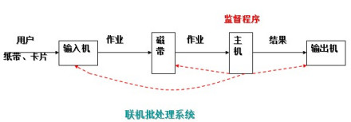

[原网页](https://baike.baidu.com/item/%E6%93%8D%E4%BD%9C%E7%B3%BB%E7%BB%9F%E5%8F%91%E5%B1%95%E5%8F%B2/7832586?fr=aladdin)

操作系统并不是与[计算机硬件](https://baike.baidu.com/item/计算机硬件/5459592)一起诞生的，它是在人们使用[计算机](https://baike.baidu.com/item/计算机/140338)的过程中，为了满足两大需求：提高资源利用率、增强计算机系统性能，伴随着计算机技术本身及其应用的日益发展，而逐步地形成和完善起来的。

## 手工操作

1946年第一台计算机诞生--20世纪50年代中期，还未出现操作系统，计算机工作采用手工操作方式。

手工操作

程序员将对应用程序和数据的已穿孔的纸带（或卡片）装入输入机，然后启动输入机把程序和数据输入计算机内存，接着通过控制台开关启动程序针对数据运行；计算完毕，打印机输出计算结果；用户取走结果并卸下纸带（或卡片）后，才让下一个用户上机。

手工操作方式两个特点：

（1）用户独占全机。不会出现因资源已被其他用户占用而等待的现象，但资源的利用率低。

（2）CPU 等待手工操作。CPU的利用不充分。

 20世纪50年代后期，出现[人机矛盾](https://baike.baidu.com/item/人机矛盾)：手工操作的慢速度和计算机的高速度之间形成了尖锐矛盾，手工操作方式已严重损害了系统资源的利用率（使资源利用率降为百分之几，甚至更低），不能容忍。唯一的解决办法：只有摆脱人的手工操作，实现作业的自动过渡。这样就出现了成[批处理](https://baike.baidu.com/item/批处理)。

## 批处理系统

[批处理系统](https://baike.baidu.com/item/批处理系统)：加载在计算机上的一个[系统软件](https://baike.baidu.com/item/系统软件)，在它的控制下，计算机能够自动地、成批地处理一个或多个用户的作业（这作业包括程序、数据和命令）。

**联机批处理系统**

首先出现的是[联机批处理系统](https://baike.baidu.com/item/联机批处理系统)，即作业的输入/输出由CPU来处理。

[主机](https://baike.baidu.com/item/主机)与输入机之间增加一个存储设备——磁带，在运行于主机上的监督程序的自动控制下，计算机可自动完成：成批地把输入机上的用户作业读入磁带，依次把磁带上的用户作业读入主机内存并执行并把计算结果向输出机输出。完成了上一批作业后，监督程序又从输入机上输入另一批作业，保存在磁带上，并按上述步骤重复处理。

监督程序不停地处理各个作业，从而实现了作业到作业的自动转接，减少了作业建立时间和手工操作时间，有效克服了[人机矛盾](https://baike.baidu.com/item/人机矛盾)，提高了计算机的利用率。

但是，在作业输入和结果输出时，主机的高速CPU仍处于空闲状态，等待慢速的输入/[输出设备](https://baike.baidu.com/item/输出设备)完成工作： 主机处于“忙等”状态。

**脱机批处理系统**

为克服与缓解：高速主机与慢速外设的矛盾，提高CPU的利用率，又引入了[脱机批处理系统](https://baike.baidu.com/item/脱机批处理系统)，即输入/输出脱离主机控制。

这种方式的显著特征是：增加一台不与[主机](https://baike.baidu.com/item/主机)直接相连而专门用于与输入/[输出设备](https://baike.baidu.com/item/输出设备)打交道的卫星机。

其功能是：

（1）从输入机上读取用户作业并放到输入磁带上。

（2）从输出磁带上读取执行结果并传给输出机。

这样，主机不是直接与慢速的输入/输出设备打交道，而是与速度相对较快的[磁带机](https://baike.baidu.com/item/磁带机)发生关系，有效缓解了主机与设备的矛盾。主机与卫星机可并行工作，二者分工明确，可以充分发挥主机的高速计算能力。

[脱机批处理系统](https://baike.baidu.com/item/脱机批处理系统):20世纪60年代应用十分广泛，它极大缓解了[人机矛盾](https://baike.baidu.com/item/人机矛盾)及主机与外设的矛盾。IBM-7090/7094：配备的监督程序就是脱机批处理系统，是[现代操作系统](https://baike.baidu.com/item/现代操作系统)的原型。

不足：每次主机内存中仅存放一道作业，每当它运行期间发出输入/输出（I/O）请求后，高速的CPU便处于等待低速的I/O完成状态，致使CPU空闲。

为改善CPU的利用率，又引入了[多道程序系统](https://baike.baidu.com/item/多道程序系统)。

## 多道程序系统

**多道程序设计技术**

所谓[多道程序设计技术](https://baike.baidu.com/item/多道程序设计技术)，就是指允许多个程序同时进入内存并运行。即同时把多个程序放入内存，并允许它们交替在CPU中运行，它们共享系统中的各种硬、软件资源。当一道程序因I/O请求而暂停运行时，CPU便立即转去运行另一道程序。

单道程序的运行过程：

在A程序计算时，I/O空闲， A程序I/O操作时，CPU空闲（B程序也是同样）；必须A工作完成后，B才能进入内存中开始工作，两者是串行的，全部完成共需时间=T1+T2。



[多道程序](https://baike.baidu.com/item/多道程序)的运行过程：

将A、B两道程序同时存放在内存中，它们在系统的控制下，可相互穿插、交替地在CPU上运行：当A程序因请求I/O操作而放弃CPU时，B程序就可占用CPU运行，这样 CPU不再空闲，而正进行A I/O操作的I/O设备也不空闲，显然，CPU和I/O设备都处于“忙”状态，大大提高了资源的利用率，从而也提高了系统的效率，A、B全部完成所需时间<<T1+T2。

[多道程序设计技术](https://baike.baidu.com/item/多道程序设计技术)不仅使CPU得到充分利用，同时改善[I/O设备](https://baike.baidu.com/item/I%2FO设备/9688581)和内存的利用率，从而提高了整个系统的资源利用率和系统吞吐量（单位时间内处理作业（程序）的个数），最终提高了整个系统的效率。

[单处理机系统](https://baike.baidu.com/item/单处理机系统)中多道程序运行时的特点：

（1）多道：计算机内存中同时存放几道相互独立的程序；

（2）宏观上并行：同时进入系统的几道程序都处于运行过程中，即它们先后开始了各自的运行，但都未运行完毕；

（3）微观上串行：实际上，各道程序轮流地用CPU，并交替运行。

[多道程序系统](https://baike.baidu.com/item/多道程序系统)的出现，标志着操作系统渐趋成熟的阶段，先后出现了[作业调度](https://baike.baidu.com/item/作业调度)管理、[处理机](https://baike.baidu.com/item/处理机)管理、[存储器管理](https://baike.baidu.com/item/存储器管理)、[外部设备](https://baike.baidu.com/item/外部设备)管理、文件系统管理等功能。

**多道批处理系统**

20世纪60年代中期，在前述的[批处理系统](https://baike.baidu.com/item/批处理系统)中，引入[多道程序设计技术](https://baike.baidu.com/item/多道程序设计技术)后形成[多道批处理系统](https://baike.baidu.com/item/多道批处理系统)（简称：批处理系统）。

它有两个特点：

（1）多道：系统内可同时容纳多个作业。这些作业放在外存中，组成一个后备队列，系统按一定的调度原则每次从后备作业队列中选取一个或多个作业进入内存运行，运行作业结束、退出运行和后备作业进入运行均由系统自动实现，从而在系统中形成一个自动转接的、连续的[作业流](https://baike.baidu.com/item/作业流)。

（2）成批：在系统运行过程中，不允许用户与其作业发生交互作用，即：作业一旦进入系统，用户就不能直接干预其作业的运行。

批处理系统的追求目标：提高系统资源利用率和系统吞吐量，以及作业流程的自动化。

[批处理系统](https://baike.baidu.com/item/批处理系统)的一个重要缺点：不提供人机交互能力，给用户使用计算机带来不便。

虽然用户独占全机资源，并且直接控制程序的运行，可以随时了解程序运行情况。但这种工作方式因独占全机造成资源效率极低。

一种新的追求目标：既能保证计算机效率，又能方便用户使用计算机。 20世纪60年代中期，计算机技术和软件技术的发展使这种追求成为可能。

## 分时系统

由于CPU速度不断提高和采用[分时技术](https://baike.baidu.com/item/分时技术)，一台计算机可同时连接多个用户终端，而每个用户可在自己的终端上联机使用计算机，好象自己独占机器一样。

分时技术：把[处理机](https://baike.baidu.com/item/处理机)的运行时间分成很短的[时间片](https://baike.baidu.com/item/时间片)，按时间片轮流把处理机分配给各[联机作业](https://baike.baidu.com/item/联机作业)使用。

若某个作业在分配给它的时间片内不能完成其计算，则该作业暂时中断，把处理机让给另一作业使用，等待下一轮时再继续其运行。由于计算机速度很快，作业运行轮转得很快，给每个用户的印象是，好象他独占了一台计算机。而每个用户可以通过自己的终端向系统发出各种操作控制命令，在充分的人机交互情况下，完成作业的运行。

具有上述特征的计算机系统称为[分时系统](https://baike.baidu.com/item/分时系统)，它允许多个用户同时联机使用计算机。

特点：

（1）多路性。若干个用户同时使用一台计算机。微观上看是各用户轮流使用计算机；宏观上看是各用户并行工作。

（2）[交互性](https://baike.baidu.com/item/交互性)。用户可根据系统对请求的响应结果，进一步向系统提出新的请求。这种能使用户与系统进行人机对话的工作方式，明显地有别于[批处理系统](https://baike.baidu.com/item/批处理系统)，因而，[分时系统](https://baike.baidu.com/item/分时系统)又被称为交互式系统。

（3）独立性。用户之间可以相互独立操作，互不干扰。系统保证各用户程序运行的完整性，不会发生相互混淆或破坏现象。

（4）及时性。系统可对用户的输入及时作出响应。分时系统性能的主要指标之一是响应时间，它是指：从终端发出命令到系统予以应答所需的时间。

分时系统的主要目标：对用户响应的及时性，即不至于用户等待每一个命令的处理时间过长。

分时系统可以同时接纳数十个甚至上百个用户，由于内存空间有限，往往采用对换（又称交换）方式的存储方法。即将未“轮到”的作业放入磁盘，一旦“轮到”，再将其调入内存；而时间片用完后，又将作业存回磁盘（俗称“滚进”、“滚出“法），使同一[存储区域](https://baike.baidu.com/item/存储区域)轮流为多个用户服务。

多用户分时系统是当今[计算机操作系统](https://baike.baidu.com/item/计算机操作系统)中最普遍使用的一类操作系统。

## 实时系统

虽然[多道批处理系统](https://baike.baidu.com/item/多道批处理系统)和[分时系统](https://baike.baidu.com/item/分时系统)能获得较令人满意的资源利用率和系统响应时间，但却不能满足实时控制与实时信息处理两个应用领域的需求。于是就产生了[实时系统](https://baike.baidu.com/item/实时系统)，即系统能够及时响应随机发生的外部事件，并在严格的时间范围内完成对该事件的处理。

实时系统在一个特定的应用中常作为一种控制设备来使用。

实时系统可分成两类：

（1）[实时控制系统](https://baike.baidu.com/item/实时控制系统)。当用于飞机飞行、导弹发射等的自动控制时，要求计算机能尽快处理[测量系统](https://baike.baidu.com/item/测量系统)测得的数据，及时地对飞机或导弹进行控制，或将有关信息通过显示终端提供给决策人员。当用于轧钢、石化等[工业生产过程控制](https://baike.baidu.com/item/工业生产过程控制)时，也要求计算机能及时处理由各类传感器送来的数据，然后控制相应的执行机构。

（2）实时[信息处理系统](https://baike.baidu.com/item/信息处理系统)。当用于预定飞机票、查询有关航班、航线、票价等事宜时，或当用于银行系统、[情报检索系统](https://baike.baidu.com/item/情报检索系统)时，都要求计算机能对[终端设备](https://baike.baidu.com/item/终端设备)发来的服务请求及时予以正确的回答。此类对响应及时性的要求稍弱于第一类。

[实时操作系统](https://baike.baidu.com/item/实时操作系统)的主要特点：

（1）及时响应。每一个信息接收、分析处理和发送的过程必须在严格的时间限制内完成。

（2）高可靠性。需采取[冗余](https://baike.baidu.com/item/冗余)措施，双机系统前后台工作，也包括必要的保密措施等。

## 通用操作系统

操作系统的三种基本类型：多道[批处理](https://baike.baidu.com/item/批处理)系统、[分时系统](https://baike.baidu.com/item/分时系统)、[实时系统](https://baike.baidu.com/item/实时系统)。

[通用操作系统](https://baike.baidu.com/item/通用操作系统)：具有多种类型操作特征的操作系统。可以同时兼有多道批处理、分时、实时处理的功能，或其中两种以上的功能。

例如：实时处理+批处理=实时[批处理系统](https://baike.baidu.com/item/批处理系统)。首先保证优先处理实时任务，插空进行批处理作业。常把实时任务称为前台作业，批作业称为后台作业。

再如：分时处理+批处理=分时批处理系统。即：时间要求不强的作业放入“后台”（批处理）处理，需频繁交互的作业在“前台”（分时）处理，[处理机](https://baike.baidu.com/item/处理机)优先运行“前台”作业。

从上世纪60年代中期，国际上开始研制一些大型的[通用操作系统](https://baike.baidu.com/item/通用操作系统)。这些系统试图达到功能齐全、可适应各种应用范围和操作方式变化多端的环境的目标。但是，这些系统过于复杂和庞大，不仅付出了巨大的代价，且在解决其可靠性、可维护性和可理解性方面都遇到很大的困难。

相比之下，[UNIX操作系统](https://baike.baidu.com/item/UNIX操作系统)却是一个例外。这是一个通用的多用户分时交互型的操作系统。它首先建立的是一个精干的核心，而其功能却足以与许多大型的操作系统相媲美，在核心层以外，可以支持庞大的软件系统。它很快得到应用和推广，并不断完善，对[现代操作系统](https://baike.baidu.com/item/现代操作系统)有着重大的影响。

至此，操作系统的基本概念、功能、基本结构和组成都已形成并渐趋完善。

## 系统发展

进入20世纪80年代，[大规模集成电路](https://baike.baidu.com/item/大规模集成电路)工艺技术的飞跃发展，微处理机的出现和发展，掀起了计算机大发展大普及的浪潮。一方面迎来了个人计算机的时代，同时又向计算机网络、[分布式处理](https://baike.baidu.com/item/分布式处理)、巨型计算机和智能化方向发展。于是，操作系统有了进一步的发展，如：个人[计算机操作系统](https://baike.baidu.com/item/计算机操作系统)、[网络操作系统](https://baike.baidu.com/item/网络操作系统)、[分布式操作系统](https://baike.baidu.com/item/分布式操作系统)等。

**个人计算机操作系统**

个人计算机上的操作系统是联机交互的[单用户操作系统](https://baike.baidu.com/item/单用户操作系统)，它提供的联机交互功能与通用[分时系统](https://baike.baidu.com/item/分时系统)提供的功能很相似。

由于是个人专用，因此一些功能会简单得多。然而，由于个人计算机的应用普及，对于提供更方便友好的[用户接口](https://baike.baidu.com/item/用户接口)和丰富功能的文件系统的要求会愈来愈迫切。

**网络操作系统**

计算机网络：通过通信设施，将地理上分散的、具有自治功能的多个计算机系统互连起来，实现信息交换、资源共享、互操作和协作处理的系统。

[网络操作系统](https://baike.baidu.com/item/网络操作系统)：在原来各自[计算机操作系统](https://baike.baidu.com/item/计算机操作系统)上，按照[网络体系结构](https://baike.baidu.com/item/网络体系结构)的各个协议标准增加网络管理模块，其中包括：通信、资源共享、系统安全和各种[网络应用服务](https://baike.baidu.com/item/网络应用服务)。

**分布式操作系统**

表面上看，[分布式系统](https://baike.baidu.com/item/分布式系统)与[计算机网络系统](https://baike.baidu.com/item/计算机网络系统)没有多大区别。[分布式操作系统](https://baike.baidu.com/item/分布式操作系统)也是通过[通信网络](https://baike.baidu.com/item/通信网络)，将地理上分散的具有自治功能的[数据处理系统](https://baike.baidu.com/item/数据处理系统)或计算机系统互连起来，实现信息交换和资源共享，协作完成任务。——硬件连接相同。

但有如下一些明显的区别：

（1）分布式系统要求一个统一的操作系统，实现系统操作的统一性。

（2）分布式操作系统管理分布式系统中的所有资源，它负责全系统的资源分配和调度、任务划分、信息传输和控制协调工作，并为用户提供一个统一的界面。

（3）用户通过这一界面，实现所需要的操作和使用系统资源，至于操作定在哪一台计算机上执行，或使用哪台计算机的资源，则是操作系统完成的，用户不必知道，此谓：系统的透明性。

（4）分布式系统更强调分布式计算和处理，因此对于多机合作和系统重构、坚强性和容错能力有更高的要求，希望系统有：更短的响应时间、高吞吐量和高可靠性。