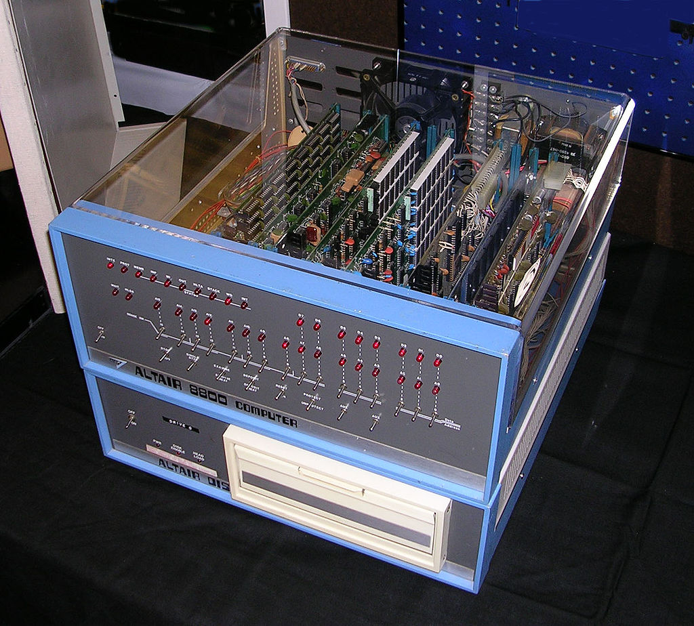
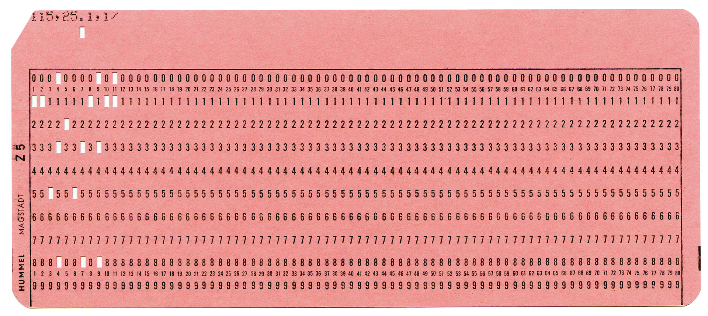
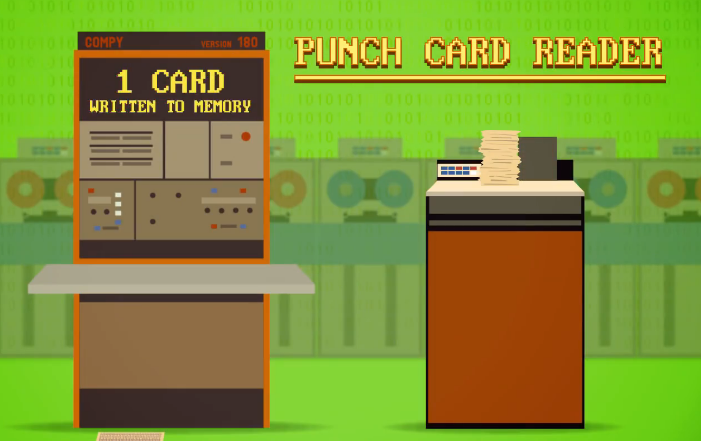
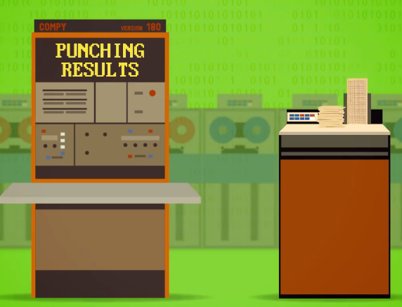
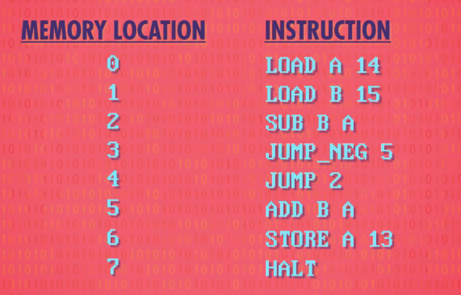
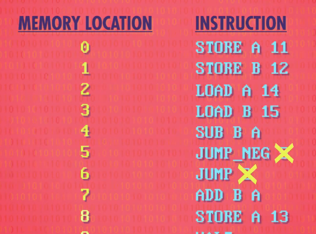
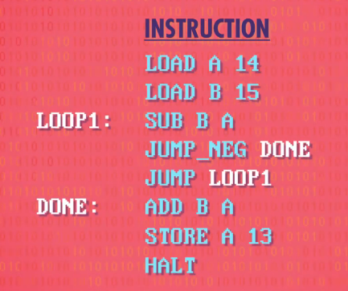

# 插线板（Plugboard）

面板有很多小插孔，程序员可以插电线，让机器的不同部分，互相传递数据和信号。运行不同的程序要重新接线。

# 面板编程（Panel Programming）

与其插一堆线到插线板，可以用一大堆开关和按钮，做到一样的效果。面板上有指示灯，代表各种状态和内存中的值，通过拨动开关输入程序。

# 存储程序

冯诺依曼计算机的标志是，一个处理器（包含算术逻辑单元ALU）、数据寄存器、指令寄存器、指令地址寄存器和内存（存储数据和指令）。

程序和数据仍然需要某种方式输入到计算机中。

## 穿孔纸卡（Punched Card）

早期计算机都有穿孔纸卡读取器，可以吸入一张卡片，把卡片的内容写入内存。如果放了一叠卡片，读取器会一个个写入内存。一旦程序和数据写入完毕，计算机开始执行。即使简单的程序也有几百条指令，要用一叠纸卡来存储。

穿孔纸卡不仅可以往计算机里存放数据，也可以取出数据。程序运行结束，将结果以打孔的方式输出到纸卡上。

## ROM和外存储器

将程序存储在ROM（Read-Only Memory）和外存储器（硬盘、软盘、光盘、U盘、磁带等）。ROM中的程序可以直接执行，外存中的程序要先加载到RAM中再执行。

### 机器语言（Machine Language）

机器语言是用二进制代码表示的、计算机能直接识别和执行的一种机器指令的集合。它是计算机的设计者通过计算机的硬件结构赋予计算机的操作功能。机器语言具有灵活、直接执行和速度快等特点。不同种类的计算机其机器语言是不兼容的，按某种计算机的机器指令编制的程序不能在另一种计算机上执行。

1. 输入设备中只有一个程序，即目标程序，没有操作系统。程序不是以文件的形式，而是直接存储二进制的代码和数据，在设备固定的位置。程序独占计算机的资源，从开始处被CPU作为指令执行，并一直执行，以死循环或停机指令结束。CPU使用平坦模型，程序对内存的访问是硬编码的，没有经过重定位，程序对数据访问和指令跳转的地址都是已知且固定的。

### 汇编语言（Assembly Language）

汇编语言是任何一种用于电子计算机、微处理器、微控制器，或其他可编程器件的低级语言。在不同的设备中，汇编语言对应着不同的机器语言指令集。一种汇编语言专用于某种计算机系统结构，而不像许多高级语言，可以在不同系统平台之间移植。使用汇编语言编写的源代码，然后通过相应的汇编器（Assembler）将它们转换成可执行的机器代码。这一过程被称为汇编过程。

2. 当修改程序时，程序中数据和指令的位置会发生变化，导致程序中根据地址获取数据、根据地址跳转、根据相对位置跳转的指令需要重新计算位置或位移，很繁琐耗时，容易出错。因此出现了汇编语言，使用各种符号和标记帮助记忆。

   汇编语言中可以使用符号标记位置，指示该指令相对于程序或者段起始处的距离。也可以使用section或segment把程序划分成几个部分，并为某部分指定一个起始距离，那么这个部分内符号的数值计算都以此为基准。在每次汇编程序的时候会重新计算每个符号的数值， 然后把所有引用到符号的指令修正到正确的地址。

   在汇编器的帮助下，除了寻址一些固定的、事先约定的地址外，程序中不需要再硬编码内存地址。

### 高级语言（High-level programming language）

高级编程语言是高度封装了的编程语言，与低级语言相对。它是以人类的日常语言为基础的一种编程语言，使用一般人易于接受的文字来表示，有较高的可读性，以方便对电脑认知较浅的人亦可以大概明白其内容。由于早期电脑业的发展主要在美国，因此一般的高级语言都是以英语为蓝本。

#### 编译型语言（Compiled language）

它是一种编程语言类型，是以编译器，先将代码编译为机器代码，再加以运行。

一般而言，用编译语言写成的程序，在运行期的运行速度，通常比用解释型语言写的程序快。因为程序在编译期，已经被预先编译成机器代码，可以直接运行，不用像解释型语言一样，还要多一道直译程序。

但是要先进行编译，之后才能运行程序，这也造成了编译语言的缺点。一般而言，编译语言的程序开发速度，以及调试时间，都是比较长的。因为它不像解释型语言可以写完一行，或一小段程序之后，马上运行，马上调试。解释型语言通常让程序开发的整体时间变少，在开发过程中，程序员也可以更弹性、快速的测试自己的想法。

为了改善编译语言的效率而发展出的即时编译技术，已经缩小了这两种语言间的差距。这种技术混合了编译语言与解释型语言的优点，它像编译语言一样，先把程序源代码编译成字节码。到运行期时，再将字节码直译，之后运行。Java与LLVM是这种技术的代表产物。

#### 解释型语言（Interpreted language）

它是一种编程语言类型，需要利用解释器，在运行期，动态将代码逐句解释（interpret）为机器代码，或是已经预先编译为机器代码的子程序，之后再运行。

许多编程语言同时采用编译器与解释器来实现，其中包括Lisp，Pascal，BASIC与 Python。JAVA及C#采用混合方式，先将代码编译为字节码，在运行时再进行解释。

Java虚拟机（Java Virtual Machine，JVM），一种能够运行Java bytecode的虚拟机，以堆栈结构机器来进行实做。最早由Sun微系统所研发并实现第一个实现版本，是Java平台的一部分，能够运行以Java语言写作的软件程序。Java虚拟机有自己完善的硬体架构，如处理器、堆栈、寄存器等，还具有相应的指令系统。JVM屏蔽了与具体操作系统平台相关的信息，使得Java程序只需生成在Java虚拟机上运行的目标代码（字节码），就可以在多种平台上不加修改地运行。通过对中央处理器（CPU）所执行的软件实现，实现能执行编译过的Java程序码（Applet与应用程序）。

Python 在执行程序时和 Java、C# 一样，都是先将源码进行编译生成字节码，然后由虚拟机进行执行，只不过 Python 解释器把这两步合二为一了而已。

#### 脚本语言（Scripting language）

它是为了缩短传统的“编写、编译、链接、运行”（edit-compile-link-run）过程而创建的计算机编程语言。早期的脚本语言经常被称为批处理语言或作业控制语言。一个脚本通常是解释运行而非编译。脚本语言通常都有简单、易学、易用的特性，目的就是希望能让程序员快速完成程序的编写工作。

虽然许多脚本语言都超越了计算机简单任务自动化的领域，比如JavaScript、Perl、PHP、Python、Ruby和Tcl，成熟到可以编写精巧的程序，但仍然还是被称为脚本。几乎所有计算机系统的各个层次都有一种脚本语言。在许多方面，高级编程语言和脚本语言之间互相交叉，二者之间没有明确的界限。

脚本语言是一种计算机程序语言，因此也能让开发者藉以编写出让电脑听命行事的程序。以简单的方式快速完成某些复杂的事情通常是创造脚本语言的重要原则，基于这项原则，使得脚本语言通常比C语言、C++语言或 Java之类的系统编程语言要简单容易，也让脚本语言另有一些属于脚本语言的特性：

- 语法和结构通常比较简单
- 学习和使用通常比较简单
- 通常以容易修改程序的“解释”作为运行方式，而不需要“编译”
- 程序的开发产能优于运行性能

### 程序设计语言要素

- 字符集

- 注释

- 数据类型（Data Type）

- 直接量

- 常量（Constant）

- 变量（Variable）

- 作用域

- 运算符（Operator）

- 表达式
	- 算术表达式
	- 关系表达式
	- 逻辑表达式
	- 赋值表达式

- 语句（Statement）
	- 空语句
	- 复合语句
	- 声明语句 
	- 表达式语句
	- 条件语句
	- 循环语句
	- 跳转语句

- 控制流（Control Flow）
	- 顺序结构（Sequence Structure）
	- 分支结构（Branch Structure）
	- 循环结构（Loop Structure）

- 函数（Function）
	- 函数定义
	- 函数调用
	- 函数重载 

- 类（Class）
	- 构造
	- 继承
	- 多态

- 数据结构
	- 数组
	- 链表
	- 集合
	- 字典

- 库（Library）